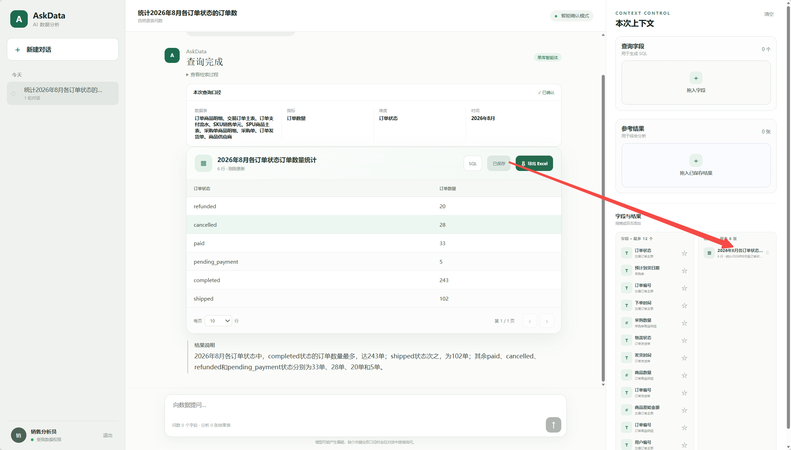

# 项目内容

**askdata问答区**[askdata问答区（群里问题不再回复）](https://my.feishu.cn/wiki/XZW2whq3YiOISrkeEkUcG9PMnlg)**，群里askdata的问题不再回复，要不会有一些重复问题，有任何问题都可以在这里添加，按照顺序，1，2，3就可**

# 项目背景\&简历撰写

**项目背景：**本项目是一个综合智能体、RAG以及大模型训练的Text2SQL项目，实现的功能是给B端的企业能够**通过自然语言达到数据库查询与分析**的功能。

直观理解来看

**以金融行业为例：**

- 每天会有大量流水数据进入数据库，需要持续进行数据汇总、指标统计和报表分析。

- 业务人员直接使用SQL存在一定技术门槛，而数据人员也需要反复编写大量查询语句，临时调整时间范围、指标口径和分析维度都会增加查数成本。

**以互联网行业为例：**

- 产品上线后会持续产生用户行为、订单和反馈数据，需要通过数据查询了解产品运行情况。

- 产品经理等业务人员不一定熟悉数据库结构和SQL语法；对于数据人员而言，大量临时、重复的查询需求同样会占用较多时间。

这些业务数据通常以**结构化表格**的形式存储在MySQL等关系型数据库中，查询和分析往往需要使用**SQL**。SQL对非技术人员具有一定的使用门槛，而对于数据人员来说，重复编写和调整SQL也会产生较高的时间成本。

因此，本项目希望利用**大模型将自然语言转化为SQL**，为业务人员提供低门槛的数据查询方式，也为数据人员提供更加快捷的查数通道，从而减少重复操作，提高整体数据查询与分析效率。

**项目名称：**AskData智能体

**简介：**面向私域的结构化表格数据，基于大模型将用户意图转化为SQL语句并执行，实现用户自然语言驱动的数据查询与分析。

---

## V2技术方案\(内测版\)

**方案：**

- **上下文聚合与动态路由：**利用大模型聚合多轮对话的上下文，形成完整的用户请求，动态路由至数据问答或数据库查询链路，分别完成**已有数据分析**与**新数据查询**。

- **索引建立与Schema检索：**建立**字段级**三级索引，利用**混合检索\&重排序**召回Query相关Schema并构建Schema图，为后续SQL生成提供准确的数据结构上下文和关联约束。

- **Human\-in\-the\-loop意图澄清：**在Schema检索后识别会实质影响查询结果的关键业务歧义，按需向用户**发起澄清**，并在用户确认后恢复后续查询执行。

- **动态Skill与任务编排：**根据问答、问数等任务类型动态加载对应Skill；每个Skill独立封装规则、Schema使用范围、工具调用与结果处理逻辑，分别指导Coder智能体和Data\-Analysis智能体生成准确的SQL和规范的数据分析报告。

- **MCP工具管理与权限校验：**基于MCP实现工具动态注册与调用，并在Schema召回、工具暴露和SQL执行阶段完成数据库、表级权限及只读SQL校验。

- **长短期记忆机制：**基于**滑动窗口\&异步摘要**的短期记忆机制，维持对话连贯性，设计**用户可选的字段\&表格主动录入**的长期记忆机制，支持关键数据内容的主动沉淀与跨会话复用。

**产出：**

- 完成AskData前后端业务逻辑开发，实现自然语言驱动的结构化数据查询与分析，支持查询结果表格展示、导出及分析报告生成。

---

**以上组织为简历👇👇👇**


# \(V2版本\)主要流程解析


**项目核心：**如上图👆👆，整个问数项目的核心在于两个智能体：**Coder智能体和Data\-Analysis智能体**，分别负责收集必要的信息完成SQL代码和调用分析与展示工具进行数据分析和生成报告。

**项目整体流程简述如下：**

1. **多轮对话上下文聚合：** 用户提出问题后，系统先聚合最近几轮对话，补全其中的省略和指代关系。

2. **意图路由：**判断当前问题属于需要查询数据 \| 进行数据分析\(问答\) \| 灰色地带，路由至不同链路。

3. **核心智能体：**Coder智能体和Data\-Analysis智能体分别对应查询和分析链路，分别可以用**SKill**进行技能的管理和增强。

    1. **Coder智能体：**向量数据库利用三级索引检索Schema，存在歧义利用Human\-in\-the\-loop向用户收集缺失的信息，在获取充足的信息后编写SQL并调用数据库工具。\(重在代码生成准确率\)

    2. **Data\-Analysis智能体：**注入表格数据，充分利用数据分析\&可视化工具生成面向不同用户生成多样性的分析报告，减少密集性劳动\(重在用户体验\)

4. **工具管理与安全机制：**基础工具、数据库工具和数据可视化工具等由MCP集中管理，在向量数据库层和MCP层基于用户ID进行过滤和拦截，权限不足无法访问以及避免生成有害的SQL。

5. **长短期记忆机制：**

    1. **短期记忆：**滑动窗口\+异步摘要\(经典老套路，重在学习\)

    2. **长期记忆：**用户主动保存\+表格与字段复用\(Text2SQL项目类型独有处理方式\)

---

**项目核心优化点：**上下文聚合\&意图路由\&短期记忆均参考经典的路线，几乎没有优化的空间，所以以上部分参考学习即可，项目核心的优化点在于**Skill增强两个智能体的行为、安全机制和可进化的长期记忆**。

- **SKill增强智能体：**Coder智能体和Data\-Analysis智能体无疑是整个的问数项目的核心，而如何增强智能体的能力关键在于SKill的配置：

    - **意图澄清与Coder能力：**什么时候需要调用普通工具查询信息、什么时候需要向用户澄清，澄清应该获取哪些内容，单表查询、联表查询、多表查询甚至SQL优化，都需要相应的SKill进行增强。

    - **数据Analysis与展示能力：**如何充分利用查询的数据、如何进行直观的可视化、如何根据使用人的用户画像和需求生成规范的报告，需要相应的SKill进行增强。

- **安全机制：**Prompt级软约束与代码级硬约束限制用户权限\&生成有害SQL的风险

- **可进化的长期记忆：**长期记忆属于用户级可以直接引用的确定性信息，并不是一成不变的，可以通过分析用户的历史轨迹数据分析用户高频使用的字段和表格，进而越用越懂用户。

> PS：以上三个方面为具体的优化点，也是指标提升的所在之处，接下来会重点更新！
> 
> 

## 多轮对话上下文聚合

用户往往不会在一轮对话中说清所有信息，后续问题经常需要结合前面的内容才能理解，因此需要对多轮对话进行上下文聚合，才能理解本轮的意图，用于后续路由和Schema检索。

上下文聚合的具体方案采用**滑动窗口**保存最近几轮的对话，再利用大模型聚合窗口内的上下文，得到完整的用户请求。

例如：

> **用户第一轮：** 查询今年各地区的销售额。
> **用户第二轮：** 只看华东地区。
> **用户第三轮：** 再按月份统计。
> 
> 

经过上下文聚合后，系统将第三轮请求理解为：

> **查询今年华东地区每个月的销售额。**
> 
> 

**PS：**这里的滑动窗口与短期记忆中的滑动窗口不太一样，短期记忆的滑动窗口以Token为单位，可以设置的更大一些，但这里的滑动窗口以轮数为单位，可以设置的小一些，因为设置过大会过度消耗Token。

### 多轮对话上下文内容

大模型接受的上下文主要包含以下内容：

- **系统提示词：** 明确大模型的角色、当前场景和需要遵循的处理规则。

- **用户 Query：** 包含用户当前轮次的 Query，以及历史的Query记录。

- **Assistant 回答：** 包含当前轮次以及历史回答。

- **表格数据：** 查询产生的表格，可以分为表格元信息和数据部分：

    - **表格元信息：** 包含表格标题、表头、行数以及生成该表格的 SQL 等信息。

    - **数据部分：** 包含数据库实际查询得到的具体数据内容。

> 由于表格的数据部分可能很长，因此不会在每次请求中都将完整数据传给大模型。进行上下文聚合和意图判断时，只需要提供用户 Query、Assistant 回答以及表格元信息，通常就可以判断用户的真实意图。
> 
> 只有当请求被路由到数据分析链路时，才会将表格的具体数据加入上下文，用于后续的数据分析，这个在后续分析链路会提到。
> 
> 

### 上下文聚合

聚合上下文时，不额外引入过多的历史信息，只保留理解当前问题所必需的内容。主要遵循以下原则：

- **以本轮 Query 为主：** 本轮 Query 的权重最高。如果本轮问题已经表达完整，则直接保留原 Query，不进行改写。

> 历史 Query：查询今年各地区的销售额。
> 本轮 Query：查询本月各客户等级的订单数量。
> 聚合结果：查询本月各客户等级的订单数量。
> 
> 

- **存在省略时才补充：** 当本轮 Query 缺少指标、维度或筛选条件时，才从历史上下文中补充必要信息。

> 历史 Query：查询今年各地区的销售额。
> 本轮 Query：只看华东地区。
> 聚合结果：查询今年华东地区的销售额。
> 
> 

- **存在指代时才改写：** 当本轮 Query 出现“这个”“刚才的结果”“第一名”等指代关系时，结合历史 Query、Assistant 回答或表格元信息明确指代内容。

> 历史结果：华东地区销售额排名第一。
> 本轮 Query：第一名是多少？
> 聚合结果：华东地区的销售额是多少？
> 
> 

- **不引入无关信息：** 历史上下文中与本轮问题无关的条件不会带入聚合结果。

> 历史 Query：查询今年华东地区的销售额。
> 本轮 Query：统计各产品类别的库存数量。
> 聚合结果：统计各产品类别的库存数量。
> 
> 

## 意图路由

意图路由用于判断当前请求应该进入哪条处理链路。不同链路使用的上下文和处理逻辑不同，因此需要先对聚合后的 Query 进行分类。

- **查询链路：** 用户需要查询新的数据，后续进行 Schema 召回、SQL 生成和数据库查询。

- **分析链路：** 用户需要分析已经查询出的数据，后续将表格的数据部分加入上下文，进行解释、总结或对比。

- **灰色区域：** 当前请求无法明确归为查询或分析，或者不需要处理数据，由大模型直接回答；缺少必要信息时，向用户继续询问。

具体实现上通过 **LangGraph 的确定性条件节点**，将请求转发到对应链路。

意图识别同样通过大模型完成。将聚合后的 Query 输入大模型，并要求模型按照固定格式输出 JSON，主要包含意图类型、判断置信度、判断原因以及对应链路需要的内容。

```Plain Text
{
  "action": "database_query | data_qa | direct_response",
  "confidence": 0.9,
  "reason": "判断原因",
  "standalone_query": "可以独立理解的完整 Query",
  "response": "",
  "response_type": "answer | clarification",
  "retrieval": {
    "retrieval_terms": [],
    "metrics": [],
    "dimensions": [],
    "filters": [],
    "time_expressions": [],
    "operations": []
  }
}
```

- **action：** 表示路由结果，分别对应查询链路、分析链路和灰色区域。

- **confidence：** 表示模型对当前路由结果的置信度。

- **reason：** 记录选择该路由的原因。

- **standalone\_query：** 进入查询链路时，输出聚合后可独立理解的完整 Query。

- **response：** 进入灰色区域时，直接输出回答或需要向用户提出的问题。

- **retrieval：** 进入查询链路时，提取指标、维度、筛选条件和时间等内容，供后续 Schema 召回使用。

后续 LangGraph 读取 JSON 中的 `action`，通过确定性条件节点进入对应的处理链路。

**Tips：为什么需要路由，以及路由如何划分？**

**路由的目的是让不同的大模型节点只处理对应的任务，并分别管理提示词、上下文和可用工具。**如果把查询、分析、澄清和工具调用全部放在一个大模型节点中，容易出现工具调用混乱，也会增加问题定位和后续优化的难度。

AskData 的主要目标是**完成意图驱动的数据库查询与数据分析**，因此核心链路只划分为两条：

- **查询链路：** 负责 Schema 召回、SQL 生成、工具调用和数据库查询。

- **分析链路：** 负责读取已有表格数据，并完成解释、总结和对比。

两条链路的上下文、工具和处理逻辑不同，拆分后可以分别进行调试和优化。

PS：路由也不适合划分得过细。路由节点只能根据用户 Query 和对话上下文判断意图，此时还没有看到后续的 Schema 和具体工具。如果分类过细，容易在路由阶段判断错误，导致后续进入错误的处理流程。路由本质上是将决策风险前置，因此各条链路需要具有清晰、稳定的边界。

在查询和分析之外，本系统增加了一个**灰色区域**，用于承接边界不明确的请求。例如“你好”等日常交流，或者信息不足、需要用户进一步说明的需求。这类请求不进入查询或分析链路，直接回答或发起澄清，既可以避免无效的工具调用，也能缩短响应时间。

## 索引建立与Schema检索

> 本部分和V1版本基本类似，但召回的Top\-k由之前的按照所提取关键词的倍数策略改为阈值策略。
> 
> 

### Schema语义信息

Schema 是根据数据库中的表格信息组织出来的数据上下文，用来描述一张表是什么、包含哪些字段、表中存储了什么数据，以及不同表之间如何关联。简单来说，**Schema 就是对数据库表格及其业务语义的完整说明**，后续会作为 Schema 召回和 SQL 生成的基础。

1. **Schema怎么来的？**

Schema 来源于数据库中已有的表格元信息。系统读取数据库、数据表、字段及部分实际数据，并对这些内容进行整理和补充。

这个过程可以由人来做，也可以由脚本来格式化提取，也可以用大模型来做，不过大模型做完后一定要经过人校验，不然容易产生幻觉。

2. **Schema越详细越好吗？**

Schema 并不是越详细越好，关键在于信息是否必要，以及不同表格之间是否具有足够的区分度。Schema 是对表格语义的说明，也是后续 Schema 召回的对象，因此需要包含 SQL 生成所必需的字段名称、数据类型、业务含义和关联关系等信息。

同时，不同表格的 Schema 应体现各自的业务用途和数据范围。如果多个表格的描述过于相似，后续召回时容易出现混淆，进而导致 SQL 选择错误的数据表或字段。

本项目主要将Schema分为三个层面：**表级 Schema、字段级 Schema 和数据级 Schema**。

1. **表级 Schema（Table\-level Schema）**

用于描述一张表的整体信息，包括：

- 表名；

- 表的业务名称，如“用户交易表”“利率信息表”；

- 表的用途和整体语义描述；

- 表所属的数据库；

- 表的主键；

- 表间关系，即当前表与其他表之间的连接方式，通常通过主键和外键建立关联。

2. **字段级 Schema（Column\-level Schema）**

用于描述字段的细粒度信息，包括：

- 字段名；

- 数据类型，如 `int`、`float`、`string`；

- 字段的业务名称；

- 字段的业务含义，如“交易次数”“年化利率”；

- 字段在表中的作用，如主键、外键、指标或维度；

- 可选信息，如字段说明、取值范围和示例值等。

3. **数据级 Schema（Data\-level Schema）**

用于描述字段对应的实际数据内容和分布特征，包括：

- 字段样例值；

- 数值字段的最大值、最小值和平均值；

- 枚举字段的可选值及其分布；

- 日期格式、编码格式和数据单位；

- 可选信息，如空值比例、重复率和异常值统计等。

表级 Schema、字段级 Schema 和数据级 Schema 的关系如下：


本项目以**字段**为召回的核心，因为字段是连接表格与实际数据的中间层。**每个字段都会同时汇总其所属表格的表级 Schema、字段自身的字段级 Schema，以及对应的数据级 Schema，形成一条完整的字段语义信息。**

例如，`trade_summary` 表中的 `interest_rate` 字段可以组织为：

```Plain Text
所属数据库：sales_db
所属表：trade_summary
表的业务含义：交易汇总表
表的用途：统计用户交易情况

字段名：interest_rate
字段类型：float
字段语义：年化利率

样例值：3.85
数值范围：0～10
数据单位：%
```

这样，后续召回 `interest_rate` 时，不仅可以得到字段本身的信息，还能同时确定它属于哪张表、表示什么业务含义，以及对应数据的格式和范围。

### 三级索引建立

在自然语言查询场景中，用户关注的通常是具体字段，而不是完整的表结构。例如，“查询交易量大于50笔的用户ID”和“统计年化利率高于3%的用户数量”，本质上都是围绕字段语义提出的需求。模型生成 SQL 时，也需要先定位具体字段，才能完成 `SELECT`、`WHERE` 和 `GROUP BY` 等操作。

因此，本项目基于整理后的字段 Schema 建立三级检索机制：

- **关键词索引：** 根据表名、字段名、业务名称和语义描述进行关键词匹配。

- **向量索引：** 将汇总后的字段Schema转换为向量，用于召回语义相近但表达方式不同的字段。

- **Rerank 重排序：** 根据用户完整 Query，对关键词索引和向量索引召回的候选字段重新排序。

三级检索所使用的索引内容均**基于表格元信息和Schema构建**，并以**字段**作为索引粒度。每条字段索引会汇总其所属表格的表级 Schema、字段自身的字段级 Schema，以及对应的数据级 Schema，结合表格元信息进行维护。

字段级三级索引机制由**关键词索引、向量索引和 Rerank 索引**组成。三类索引均以字段级 Schema 为核心，同时融合字段所属的表级 Schema 和对应的数据级 Schema，但不同索引使用的信息粒度有所不同。

1. **关键词索引**

关键词索引用于字段的精准召回，主要包含：

- 字段名称及同义词；

- 所属表名称及业务名称；

- 表和字段相关的业务术语；

- 部分具有代表性的数据关键词。

系统通过关键词匹配，快速筛选与用户 Query 存在直接关联的候选字段。

2. **向量索引**

向量索引用于语义级 Schema 召回。系统将字段级、表级和数据级信息整理成一段简洁、聚焦的自然语言描述，再通过 Embedding 模型生成向量。

即使用户使用的表达与实际字段名称不同，也可以通过语义相似度召回相关字段。

3. **Rerank 索引**

Rerank 索引用于候选字段的精确排序。其内容比向量索引更加完整，可以包含：

- 字段名称和业务语义；

- 所属表及其业务用途；

- 数据类型和字段角色；

- 示例值、取值范围和数据分布；

- 字段适用的业务场景。

Rerank 模型同时读取用户完整 Query 和候选字段的详细 Schema，判断两者的实际相关性，并对候选字段重新排序。

> 以字段 `trade_volume`（交易量）为例：
> 
> **关键词索引：**
> 
> ```Plain Text
> trade_volume、交易量、交易总量、成交量、trade_summary、
> 用户交易汇总表、交易统计表、高频交易、大额交易
> ```
> 
> **向量索引：**
> 
> ```Plain Text
> trade_volume 属于 trade_summary 用户交易汇总表，
> 表示用户在一定时间范围内的交易总量，用于衡量用户的交易活跃程度。
> ```
> 
> **Rerank 索引：**
> 
> ```Plain Text
> 字段名：trade_volume
> 所属表：trade_summary（用户交易汇总表）
> 数据类型：int
> 字段语义：用户在一定时间范围内的交易总量
> 取值范围：大于等于0
> 数据分布：取值范围为0～99999，多数用户集中在0～50
> 业务用途：统计用户活跃度、筛选高频交易用户
> ```
> 
> 

**Tips：为什么不直接将所有详细信息放入向量索引？**

向量索引的主要任务是从大量 Schema 中快速召回相关字段，因此索引文本需要简洁并聚焦于字段的核心语义。如果加入过多的数据分布、业务场景和补充说明，弱相关信息可能会干扰核心语义，使生成的向量无法准确表示字段最主要的含义，这种现象可以称为**语义稀释**。

需要注意的是，Embedding 模型并不一定只是对所有 Token 向量进行简单平均。更准确地说，文本越长、包含的语义主题越多，有限维度的向量就需要同时表达更多信息，字段的核心语义可能因此变得不够突出。

> 例如：
> 
> **简洁描述：**
> 
> 这段描述主要围绕“交易总量”和“交易活跃度”展开，向量表达的语义相对集中。
> 
> **冗长描述：**
> 
> 这段描述同时引入了用户画像、风险控制和行为分析等多个主题，可能削弱“交易总量”这一核心语义在向量中的区分度。
> 
> 

因此，向量索引使用较短且聚焦的语义描述，优先保证候选字段的召回效果；Rerank 阶段再使用更完整的 Schema 信息进行精确判断。两者分别负责“先召回”和“再精排”，在检索范围与排序准确率之间取得平衡。

### Schema检索与图召回

基于预先建立的字段级三级索引，本项目采用“**关键词检索 \+ 向量检索 \+ RRF 融合 \+ Rerank 重排序**”的方式，召回与用户 Query 相关的字段。字段召回完成后，再补充字段所属表及表间关联关系，最终组织成 Schema 图，用于约束后续的任务推理和 SQL 生成。

整体流程分为四个阶段：

```Plain Text
核心检索词提取
       ↓
关键词与向量双路检索
       ↓
RRF 融合 + Rerank 重排序
       ↓
字段召回结果 → Schema 图
```

基于预先建立的字段级三级索引，系统采用“**关键词检索 \+ 向量检索 \+ RRF 融合 \+ Rerank 重排序**”的方式，召回与用户 Query 相关的字段。字段召回完成后，再补充字段所属表及表间关联关系，最终组织成 Schema 图，用于约束后续的任务推理和 SQL 生成。

整体流程分为四个阶段：

```Plain Text
核心检索词提取
       ↓
关键词与向量双路检索
       ↓
RRF 融合 + Rerank 重排序
       ↓
字段召回结果 → Schema 图
```

#### 核心检索词提取

首先从聚合后的 Query 中提取需要查询的核心指标、维度、筛选字段和业务概念，作为后续 Schema 检索的输入。

例如：

> **用户 Query：**
> 查询总交易笔数大于50000的用户对应的年化利率。
> 
> **提取结果：**
> 总交易笔数、用户、年化利率
> 
> 

核心检索词尽量保留用户的原始表达，不提前转换成具体字段名。例如用户说“总交易笔数”，此时不直接改写成 `total_trade_count`，而是交给后续的关键词检索和向量检索完成匹配。

该阶段不需要额外调用一个大模型。在具体实现中，可以将核心检索词提取与前面的**上下文聚合和意图路由**合并，在同一次大模型调用中结构化输出：

```Plain Text
{
  "action": "database_query",
  "standalone_query": "查询总交易笔数大于50000的用户对应的年化利率",
  "retrieval": {
    "retrieval_terms": [
      "总交易笔数",
      "用户",
      "年化利率"
    ],
    "metrics": [
      "年化利率"
    ],
    "dimensions": [
      "用户"
    ],
    "filters": [
      "总交易笔数大于50000"
    ]
  }
}
```

这样可以减少一次模型调用，降低整体耗时，同时保证路由结果与 Schema 检索词使用同一份聚合后的 Query。

#### 关键词与向量双路检索

得到核心检索词后，系统同时执行关键词检索和向量检索，分别解决精准匹配和语义匹配问题。

- **关键词检索：** 基于 BM25 倒排索引，匹配字段名、字段别名、表名和业务术语，适合召回表达一致或存在明确关键词的字段。

- **向量检索：** 基于 Embedding 向量计算语义相似度，适合召回名称不同但业务含义相近的字段。

以“总交易笔数”为例：

- 关键词检索可以直接匹配“总交易笔数”“交易笔数”等字段别名；

- 向量检索可以进一步召回描述为“用户累计完成的交易次数”的字段。

两路检索的结果可能存在重复，也不能直接比较原始分数。因此，系统先对候选字段进行去重，再使用 RRF（Reciprocal Rank Fusion）进行融合排序。

RRF 主要根据字段在两路检索中的排名计算融合分数，不要求 BM25 分数和向量相似度具有相同的取值范围。如果一个字段在两路检索中排名都较高，融合后的排名也会相应提高。

召回数量可以根据检索词数量动态调整：

- 检索词较少时，适当扩大每路检索的 Top\-K，避免遗漏相关字段；

- 检索词较多时，可以适当降低单个检索词的 Top\-K，减少重复候选；

- 最后将所有检索词的结果统一合并和去重，形成粗召回字段集合。

#### Rerank 重排序

关键词检索和向量检索完成后，候选集合中仍可能存在名称相近但实际业务含义不同的字段。例如：

- 交易笔数；

- 交易量；

- 成交数量；

- 交易金额。

这些字段在关键词或向量空间中可能非常接近，但对应的数据类型、统计口径和业务用途并不相同。因此，需要使用 Rerank 模型对候选字段进行更加细致的判断。

Rerank 阶段将用户完整 Query 与候选字段的详细 Schema 放在一起比较，使用的信息包括：

- 字段名称和业务含义；

- 字段数据类型；

- 字段所属表及表的业务用途；

- 样例值和取值范围；

- 数据分布特征；

- 字段在业务中的使用场景。

Embedding 检索通常分别编码 Query 和 Schema，再计算两者的向量相似度，适合从大量字段中快速召回候选结果。Rerank 则对 Query 和每个候选 Schema 进行联合计算，可以识别两者之间更加细粒度的对应关系。

因此，两个阶段的分工为：

- **关键词检索和向量检索：** 优先保证召回范围，快速找出可能相关的字段。

- **Rerank 重排序：** 优先保证排序精度，从候选集合中筛选真正符合用户需求的字段。

引入 Rerank 会增加模型调用和检索耗时，因此不需要对全部 Schema 直接执行 Rerank，而是只对粗召回后的有限候选集合进行重排序。

#### 组织 Schema 图

Rerank 完成后，系统得到与用户 Query 最相关的字段。仅有字段信息还不足以生成 SQL，因此需要继续补充：

- 字段所属的数据库；

- 字段所属的数据表；

- 数据表的业务含义；

- 字段的数据类型；

- 查询涉及的主键和外键；

- 多张表之间的关联关系。

最终将这些内容组织为 Schema 图。Schema 图只保留本次查询需要的表、字段和关联路径，避免将全量数据库 Schema 直接提供给后续模型。

例如：

> **用户 Query：**
> 查询总交易笔数大于50000的用户对应的年化利率。
> 
> **核心检索词：**
> 总交易笔数、用户、年化利率
> 
> **直接召回字段：**
> 
> ```Plain Text
> trade_summary.total_trade_count
> interest_info.interest_rate
> ```
> 
> 为完成两张表的关联，系统继续补充关系字段：
> 
> ```Plain Text
> trade_summary.user_id
> interest_info.user_id
> ```
> 
> 

最终组织出的 Schema 图如下：

```Plain Text
数据库：finance_db

┌──────────────────────────────────┐
│ trade_summary                    │
│ 用户交易汇总表                   │
│ 用途：记录每个用户的累计交易情况 │
├──────────────────────────────────┤
│ user_id : int                    │
│   语义：用户唯一标识             │
│   角色：主键                     │
│                                  │
│ total_trade_count : int          │
│   语义：用户累计交易总笔数       │
│   取值范围：大于等于0            │
│   样例值：120、5800、56000       │
└────────────────┬─────────────────┘
                 │
                 │ user_id
                 │
┌────────────────▼─────────────────┐
│ interest_info                    │
│ 用户利率信息表                   │
│ 用途：记录用户当前生效的利率信息 │
├──────────────────────────────────┤
│ user_id : int                    │
│   语义：用户唯一标识             │
│   角色：外键                     │
│                                  │
│ interest_rate : decimal          │
│   语义：用户当前年化利率         │
│   单位：%                        │
│   样例值：2.35、3.12、4.58       │
└──────────────────────────────────┘

表关联关系：
trade_summary.user_id = interest_info.user_id

关联含义：
通过用户ID，将用户累计交易情况与当前生效的年化利率进行关联。
```

## Coder智能体\(核心\)

Coder智能体就是专门负责SQL编写和执行的。它接收上游传递的任务和Schema信息，通过Skill增强 SQL 生成能力，再利用MCP调用对应的数据库工具执行。如果发现现有信息不足以生成满足用户需求的SQL，就会引入Human in the Loop，让用户补充或确认关键信息。

具体分为三个部分：

- **MCP 工具封装与执行\(发现工具和具体执行\)**
MCP 中注册了多个数据库查询服务工具，由 MCP Server 对外提供数据库能力，MCP Client 负责发现和管理这些工具。SQL 生成后，Coder 选择对应的工具，通过 MCP Client 调用 MCP Server，完成 SQL 执行并返回结果。

- **Skill 增强的 SQL 编写\(调用工具和传递参数\)**
Coder 根据上游传递的任务描述和 Schema 信息，加载对应数据库的 Skill。Skill 中包含数据库方言、SQL 编写规范和安全限制，帮助 Coder 生成符合目标数据库要求的 SQL。

- **Human in the Loop 澄清\(人工参与决策\)**
如果 Coder 判断当前信息不足，或者用户需求存在歧义，无法生成满足要求的 SQL，就会暂停生成流程并向用户发起澄清。例如，“项目余额”存在多个统计口径时，需要用户确认是账户余额还是可用余额。用户补充信息后，Coder 再继续生成并执行 SQL。

PS：

- **MCP中可不仅仅只有数据库SQL工具，还有一系列基础的工具。**比如查询时间\(用户问今天的总收益是多少，需要调用查询今天时间的工具\)，查询数据库状态\(这为后续SQL的优化做准备提供信息\)等，Coder智能体要先调用这些工具得到完成SQL编写的全部信息，才会调用数据库工具来执行SQL。

- **Skill是Coder调用工具的行动指南**，它会根据用户的需求和Schema去动态发现能力，按照Skill中的规则来逐步调用工具，比如**单库查询、联表查询、多表查询**等等，这些技能规则都可以在SKill中体现。

- **Human in the loop澄清：**实际上澄清同样也是一个工具，只不过他要阻塞当前的工具调用状态，让用户确认之后，才能继续，哪些情况需要澄清同样也可以由Skill进行管理。


**后续功能补充**

- **Harness工程：**实际上Coder智能体完全可以结合Harness进行Skill管理和自我纠错，但由于目前的Skill数量还比较少，并且要根据具体的场景累计一些Bad case再引入Harness工程，对此有想法的uu们也欢迎向我私信反馈，我会综合大家的技术方案设计这一功能。

### MCP查询工具封装

> MCP的具体定义和用法参考：[项目内容](https://dcnz7910hv4k.feishu.cn/wiki/Ont6wujppiKejrkDM09c3Py8n6g#share-BClhdgBfFop5tGxvXnxcT3DnnCg)
> 
> 

我们通过 MCP 对数据库查询能力进行统一管理，整个过程分为数据库工具封装、工具动态注册和 SQL 调用执行。目前项目使用** DuckDB **完成本地实现，生产环境可以替换成 MySQL、PostgreSQL 或 ClickHouse，整体调用流程不需要改变。

#### 数据库工具封装

我们会为每个数据源配置数据库类型、连接地址、数据库名称、只读账号、超时时间和返回行数限制，例如：

```Plain Text
数据源名称：project_db
数据库类型：MySQL
数据库地址：mysql-project.internal:3306
数据库名称：project_center
查询账号：project_readonly
```

MCP Server 根据这份配置创建连接池，并将其封装成对应的数据库工具：

```Plain Text
query_project_db
```

其中，数据库地址、账号和密码不会提供给 Coder，而是由 MCP Server 在服务端统一管理。

> 目前项目使用** DuckDB **模拟真实数据库，因为没必要去单独
> 
> 不同数据库的数据按照目录进行隔离，每个 CSV 文件映射成一张 DuckDB 只读视图，例如：
> 
> 

```Plain Text
databases/
└── project_db/
    ├── project_info.csv
    └── project_balance.csv
```

运行时，`project_info.csv` 会被映射为 `project_info` 表。我们再将 `project_db` 的查询能力封装成独立的 MCP Tool：

```Plain Text
query_project_db
```

工具接收 SQL，统一返回执行状态、查询字段、结果数据、返回行数和异常信息。

#### MCP 工具动态注册

MCP Server 启动时会读取 Schema 中的数据源信息，按照“一库一工具”的方式动态注册数据库工具。

例如系统中存在项目库和交易库，就会注册：

```Plain Text
query_project_db
query_trade_db
```

注册工具时，还会结合当前用户的数据权限。如果用户只有项目库权限，那么 MCP Server 只会向他暴露 `query_project_db`。

MCP Client 在每次任务开始时通过 `tools/list` 获取当前可用工具，包括工具名称、功能描述和参数格式，再把这些工具提供给 Coder。这样新增数据库时，只需要增加数据源和工具配置，不需要修改 Coder 的核心逻辑。

#### SQL 调用与执行

例如用户问：

> 查询今年项目余额大于50000的项目。
> 
> 

Coder 根据上游传递的 Schema 信息生成 SQL：

```Plain Text
SELECT
    project_name,
    project_balance
FROM project_info
WHERE create_time >= '2026-01-01'
  AND create_time < '2027-01-01'
  AND project_balance > 50000;
```

Coder 根据 Schema 中的数据库标识，选择 `query_project_db`。MCP Client 再通过 `tools/call` 将 SQL 发送给 MCP Server：

```Plain Text
{
  "name": "query_project_db",
  "arguments": {
    "sql": "SELECT project_name, project_balance ..."
  }
}
```

MCP Server 收到请求后，会先检查：

- 是否为单条只读 SQL；

- 是否只包含 `SELECT` 或 `WITH`；

- 表是否属于 `project_db`；

- 用户是否具有数据库和表权限；

- 是否存在写操作、`SELECT *` 等风险；

- 查询是否超过超时时间和返回行数限制。

校验通过后，目前由 DuckDB 加载对应目录下的 CSV 视图并执行 SQL；在生产环境中，则由 MCP Server 从连接池中获取真实数据库连接并执行。

最后，MCP Server 将查询结果或异常信息返回给 MCP Client，再交给下游校验模块。

### Skill增强的SQL代码编写

SQL本身规则性比较强，即使不使用 Skill，只通过 Prompt，大模型也能完成大约九成左右的基础SQL编写。\(不要小瞧目前大模型的能力！！！\)

但是真正困难的不是写出一条语法正确的 SQL，而是让 SQL 在时间范围、指标口径、表关联和字段选择上准确符合用户意图。Skill 的作用就是把项目中的 SQL 编写经验和限制沉淀成一套稳定规则，减少模型每次临时理解带来的偏差。

#### Skill加载方式

项目启动时，`SkillRegistry` 会扫描 Skill 目录，读取每个 Skill 的 `SKILL.md` 和 `config.json`。

其中：

- `SKILL.md` 保存具体的执行规则和 SQL 编写要求；

- `config.json` 定义 Skill 名称、允许使用的工具、最大工具调用次数和允许输出的动作。

    - `config.json` 中的 `allowed_tools` 用于声明该 Skill 可以使用哪些工具。Coder 加载 Skill 后，程序会根据 `allowed_tools` 对 MCP Client 返回的工具列表进行代码级过滤，同时只保留当前目标数据库对应的 `query_*` 工具。模型选择工具后，程序还会再次校验工具名称是否在过滤后的列表中，不符合要求的调用会被直接拒绝。

Coder 执行任务时，会根据任务类型加载对应的 Skill，并将 Skill 指令作为系统指令，同时传入用户问题、目标数据库、Schema 图、检索字段、用户确认参数和 MCP 工具列表。

#### 具体Skill配置

> 后续会不断引入新的Skill，并结合具体的业务场景，以下是已经配置好的Skill
> 
> 

##### 单表单库查询基础Skill

`database_query` Skill 用于指导模型根据用户问题和字段级Schema图完成单数据库查询。模型先规划查询口径，再选择表、字段和关联关系，处理时间与聚合计算，确定返回列，最后生成并核验只读SQL；信息充分时调用数据库工具，关键口径缺失时发起澄清。

该 Skill 允许调用：

```Plain Text
current_datetime
resolve_date_range
query_*
```

最多调用3次，只允许输出两种动作：调用工具或者发起澄清。

**核心规则：**

- **查询规划：** 生成SQL前，先确定查询粒度、指标、维度、筛选条件、返回字段、排序方式和Top N。问题中的平台、渠道、分类、类型和状态等修饰词必须落实为查询条件，不能只作为背景理解。

- **字段与表选择：** 只能使用Schema图中的表、字段和关联关系，优先选择与业务指标直接对应的事实表或预聚合表。单表能够完成时使用单表；必须联表时，沿事实记录自身的外键关联，避免绕路或因一对多关系造成重复统计。

- **时间处理：** 时间条件必须作用在被统计事实的日期字段上。“某年”“某月”转换为明确范围，“截至某月”只限制结束时间；“今天、本月、上月”等相对时间会影响结果时，先调用时间工具取得明确日期。

> 例如用户问：
> 
> 

> 查询本月各地区的销售额。
> 
> 

> Schema 中“销售额”对应的是 `paid_amount`，时间字段是 `order_date`。Coder 加载基础 SQL 查询 Skill 后，会先调用 `resolve_date_range`，把“本月”转换成明确日期，再生成：
> 
> ```Plain Text
> SELECT
>     region AS "地区",
>     SUM(paid_amount) AS "销售额"
> FROM orders_current
> WHERE order_date >= '2026-08-01'
>   AND order_date < '2026-09-01'
> GROUP BY region
> ORDER BY "销售额" DESC;
> ```
> 
> 最后选择 `query_askdata_mock` 工具执行。
> 
> 

- **指标计算：** 按照Schema定义的聚合方式处理字段，`sum`使用 `SUM`，`avg`使用 `AVG`，维度字段进入 `GROUP BY`。整体比率应使用汇总后的分子除以分母，不能直接平均明细比率；金额和平均值通常保留2位，比例保留4位。

- **返回字段：** SQL生成前先确定最终列，按照“业务维度→基础业务量→派生指标”组织。只返回用户要求的字段和解释结果所必需的基础量，不返回技术主键、排名序号、CTE中间字段或其他无关指标。

- **SQL生成：** 同一数据库需要的数据尽量通过一条SQL完成。普通筛选、分组和聚合优先生成单层 `SELECT`，只有必须分阶段计算时才使用CTE或窗口函数。只能生成 `SELECT` 或 `WITH`，禁止 `SELECT *`，最多返回200行。

- **SQL核验：** 调用数据库工具前，检查查询粒度、事实表、时间字段、聚合方式、关联关系、筛选条件和返回列是否与用户问题一致。任何明确条件遗漏、字段归属错误或业务口径变化，都必须先修正SQL。

- **用户澄清：** 只有缺少的信息会实质改变查询结果，并且无法从用户问题、确认参数或Schema中确定时，才向用户提问。问题已经明确时直接执行，不能重复澄清。

- **工具调用：** 只能调用 `current_datetime`、`resolve_date_range` 和当前数据库对应的 `query_*` 工具，最多调用3次。一般用于时间解析、数据库查询以及SQL失败后的修正重试。

- **输出格式：** 模型只能返回 `call_tool` 或 `clarify`。调用数据库时必须同时返回 `query_contract`，记录查询粒度、来源表、筛选条件、指标和输出列，且这些内容必须与SQL完全一致。


### Human\-in\-the\-loop澄清

Coder 在生成 SQL 前，会先判断现有信息是否足以确定查询对象、字段和业务口径。如果关键信息不足，并且不同选择会直接改变 SQL 或查询结果，就不会让模型自行猜测，而是暂停流程，请用户进行确认。

#### 澄清条件

澄清条件有很多种表现形式，例如：

1. **Schema 信息不足或匹配置信度过低**
Coder 能看到的 Schema 中缺少完成查询所需的字段。可能是用户没有说对字段名称，也可能是权限过滤导致相关 Schema 不可见。例如用户说“查询沉淀资金超过50000的项目”，但当前 Schema 中没有与“沉淀资金”高置信度匹配的字段，就需要确认它具体指哪个指标。

2. **存在多个难以区分的候选字段**
多个表中存在名称相同或含义相近的字段，并且不同选择会改变结果。例如用户说“按地区统计销售额”，但 Schema 中同时存在订单地区和客户地区，就需要确认按哪个地区统计。

3. **查询条件不完整**
用户已经说明要查询什么，但缺少生成 SQL 必需的条件，例如时间范围、统计维度、聚合方式或者排序数量。例如用户说“查询排名靠前的项目”，但没有说明按照什么指标排序以及返回多少条，需要进一步确认。

4. **具体业务规则不明确**
不同业务有各自的指标定义和处理规则，不能由 Coder 自行推断，这就要依据具体的业务写明澄清规则。

澄清的规则也可以写在Skill中。

##### Schema 召回结果不足\(权限\)或置信度过低

**最常见的一种情况是用户召回的Schema中没有用户想要的字段**

一种情况是**数据权限不足**。

例如用户问：

> 查询今年项目余额大于50000的项目。
> 
> 

“项目余额”字段实际在财务库中，但当前用户只有项目管理库的权限。Schema 检索会先进行权限过滤，因此最终只召回项目名称、创建时间等字段，没有可用的余额字段。

这时系统不会暴露无权限的表和字段。

另一种情况是**用户使用了 Schema 中不存在的业务表达，或者太模糊了。**

例如用户问：

> 查询今年沉淀资金超过50000的项目。
> 
> 

Schema 中只有“项目账户余额”“可用余额”和“剩余预算”等字段，没有“沉淀资金”这个名称或别名，导致相关字段的**检索置信度**都比较低，系统无法判断用户具体指哪一个指标。

这时会进一步询问：

> “沉淀资金”是指项目账户余额、当前可用余额，还是未使用的项目预算？
> 
> 

用户确认口径后，系统把确认结果写入查询上下文，再重新进行 Schema 检索和 SQL 生成。

##### 相同字段属于不同数据表

例如用户问：

> 按地区统计本月销售额。
> 
> 

Schema 中同时存在：

```Plain Text
orders_current.region：订单所属的销售地区
customers.region：客户注册或主要经营地区
sales_targets.region：销售目标所属地区
```

虽然字段名称都是 `region`，但业务含义不同。如果直接选择，最终的分组结果可能完全不同。因此系统会询问用户：

> 这里的地区是指订单销售地区，还是客户所在地区？
> 
> 

用户确认“订单销售地区”后，系统会记录该选择，后续 SQL 使用 `orders_current.region`，避免再次产生相同歧义。

##### 查询条件不完整

Schema 已经能够准确匹配用户需要的表和字段，但用户没有提供生成 SQL 所必需的查询条件，例如时间范围、筛选阈值、统计维度或者 TopN 数量。

例如用户问：

> 查询今年项目余额较高的项目。
> 
> 

系统能够找到项目名称、项目余额和时间字段，但“余额较高”无法直接转换成确定的 SQL 条件。它既可能表示余额超过某个数值，也可能表示按照余额排序取前几名。

因此系统会进一步询问：

> “项目余额较高”是指余额大于某个金额，还是按照项目余额排序取前几名？
> 
> 

如果用户确认“按照余额排序取前10名”，系统会将这个条件记录到查询上下文中，并生成类似下面的逻辑：

```Plain Text
ORDER BY project_balance DESC
LIMIT 10
```

类似的情况还包括：

- “查询最近的项目”，但没有说明“最近”是多长时间；

- “统计项目余额”，但没有说明是求和、平均值还是直接展示明细；

- “按项目统计”，但没有说明需要返回哪些统计指标。

#### Human\-in\-the\-loop实现

> 目前Human\-in\-the\-loop基于Langgraph实现。
> 
> 

在当前实现中，如果 Coder 判断需要澄清，就会返回 `clarify` 动作和具体的澄清问题。LangGraph 根据这个状态路由到 `human_clarification` 节点，并通过 `interrupt` 暂停工作流。

当前任务状态会通过 Checkpointer 保存，包括用户问题、Schema 图、检索结果和已经完成的步骤。用户回复后，系统使用 `Command(resume=...)` 恢复原任务，将用户确认的字段或参数写入 `workspace`，然后重新进入 Schema 检索和 SQL 生成流程。

Human in the Loop 不一定必须使用 LangGraph，自己实现状态机也可以，但 LangGraph 对工作流的中断、状态保存和恢复执行做了专门支持，实现起来更方便。

## 安全与权限校验

**安全与校验主要从两个方面进行：**

- 基于用户身份控制能够看到和访问的数据；

- 对生成的 SQL 进行强制检查，避免出现越权查询、写操作和危险语句。

### 用户身份与数据权限校验

**整体采用的是多层校验：**Schema 不可见、MCP 工具不可见、SQL 执行前再次鉴权。

用户完成身份认证后，系统会根据用户 ID 获取对应的数据库和数据表权限，生成当前用户的权限范围。

权限控制主要体现在三个阶段：

1. **Schema 检索阶段**

Schema 写入向量数据库时会携带数据库、数据表和权限等元数据。用户发起检索时，系统会根据用户 ID 对检索范围进行过滤。

用户没有权限的数据表不会进入 Schema 召回结果，因此后续模型也看不到这些表的名称、字段、描述和数据样例，避免在生成 SQL 前就发生数据结构泄露。

2. **MCP 工具发现阶段**

MCP Server 会根据当前用户的数据库权限动态注册并暴露工具。

例如用户只有 `project_db` 的权限，那么 MCP Client 通过 `tools/list` 只能发现：

```Plain Text
query_project_db
```

无权访问的 `query_trade_db` 不会出现在工具列表中，Coder 也无法选择该工具。

3. **MCP 工具执行阶**

工具不可见并不能作为唯一的安全措施，因为模型或者调用方仍可能伪造工具名称或 SQL。

因此 MCP Server 在执行前会再次校验用户身份，包括：

- 是否有权访问目标数据库；

- 是否有权访问 SQL 中引用的数据表；

- SQL 是否引用了当前工具之外的数据库或表；

- CTE 和子查询中是否包含无权限的数据表。

即使调用方绕过工具发现，直接构造调用请求，也会在执行阶段被拒绝。

### SQL执行安全校验

SQL 生成后不会直接发送给数据库，而是先通过 SQL 解析器进行结构化校验。**目前使用 SQLGlot 将 SQL 解析成语法树，再根据语法节点判断是否安全，而不是只通过字符串匹配。**

**主要限制包括：**

1. **只允许只读查询**

只允许执行 `SELECT` 和 `WITH`，禁止：

```Plain Text
INSERT、UPDATE、DELETE、MERGE
CREATE、DROP、ALTER
GRANT、REVOKE
COPY、ATTACH、DETACH
事务和数据库管理命令
```

2. **一次只能执行一条 SQL**

禁止通过分号拼接多条语句，例如：

```Plain Text
SELECT project_name FROM project_info;
DROP TABLE project_info;
```

3. **禁止使用 ****`SELECT *`**

必须明确写出查询字段：

```Plain Text
SELECT project_name, project_balance
FROM project_info;
```

这样可以避免返回无关字段、敏感字段或者大规模数据，也方便检查字段权限。

4. **限制 SQL 和结果规模**

工具会限制 SQL 参数长度，并且每次查询最多返回200行\(这个数量可以自己设定\)，避免一次返回大量数据。

## 短期记忆机制

> 短期记忆还是沿用V1版本中的滑动窗口\+异步摘要的设计，在细节上做了优化。
> 
> 

短期记忆主要解决多轮对话中的上下文连续性问题。当前实现采用**“滑动窗口 \+ 异步增量摘要”**：近期对话保留完整内容，较早对话压缩成摘要，在控制 Token 消耗的同时保留用户目标和已确认条件。

### 滑动窗口

系统按照 `session_id` 管理每个会话的历史轮次。每一轮会记录：

- 用户问题；

- 查询路由和执行状态；

- 查询结果标题；

- 模型给出的结果说明；

- 返回字段和数据行数。

> PS：完整结果表不会直接放入短期记忆，只保留表头和行数，避免大量数据占满上下文。需要分析最近一次查询结果时，再单独加载部分数据，当前最多加载50行。
> 
> 

窗口主要通过Token数控制。当前配置是：

```Plain Text
摘要触发阈值：12000 Token
单次摘要大小：约6000 Token
至少保留最近5个完整轮次
```

> PS：为什么不用轮数控制，因为轮数一增多，会频繁触发异步摘要消耗Token，这样会让整个系统非常不稳定，本着只要大模型的上下文窗口可以接受的原则，就不触发异步摘要，只有超过大模型的上下文才会按需触发异步摘要功能。
> 
> 

当上下文没有超过阈值时，模型可以直接看到尚未摘要的完整对话；超过阈值后，系统从最早的历史轮次开始压缩，同时保护最近5轮不进入摘要。

> 前文也提到，上下文聚合的窗口与本次的窗口大小和策略都不一样
> 
> 上下文聚合使用一个更小的窗口，只读取最近X轮对话，不加载历史摘要，避免过早的历史内容影响当前路由判断。
> 
> 

### 异步摘要

每轮对话完成并写入会话记录后，系统会检查当前上下文是否超过12000 Token。如果超过，就将最早约6000 Token 的完整轮次提交到后台线程进行摘要。

摘要不是重新总结整个会话，而是采用增量合并：

```Plain Text
上一版摘要 + 本次需要压缩的旧轮次 → 新版摘要
```

摘要模型重点保留：

- 用户的查询目标；

- 已经确认的业务口径；

- 时间范围和筛选条件；

- 关键查询结果；

- 已得出的分析结论；

- 尚未完成的问题。

摘要任务在后台线程中执行，正常请求不会等待。摘要期间，新请求仍然使用上一版已完成摘要和当前未摘要轮次，因此不会阻塞用户查询。

同一会话同时只运行一个摘要任务，避免多个线程重复压缩相同内容。摘要成功后，系统更新摘要内容和已摘要的轮次 ID；如果摘要失败，则不会标记这些轮次，原始内容仍会继续进入上下文，避免信息丢失。

### 上下文组装

最终提供给模型的短期上下文由两部分组成：

```Plain Text
历史摘要 + 尚未摘要的近期完整轮次
```

例如一个会话累计超过12000 Token 后，系统会将最早约6000 Token 的对话压缩成摘要，最近5轮继续保留原文。下一次请求不需要携带全部历史，只需要携带摘要和近期窗口。

原始轮次不会因为生成摘要而立即删除。项目支持通过 `SessionArchive` 持久化原始会话和摘要状态，服务重新启动后可以恢复，摘要主要用于压缩模型上下文，而不是替代原始记录。

**简单来说，滑动窗口保证模型准确理解最近发生的对话，异步摘要负责保留更早的关键信息，两者结合控制上下文长度，同时不阻塞当前请求。**

## 长期记忆机制

长期记忆主要用于跨会话复用用户确认过的查询结果和 Schema 字段。当前采用用户主动保存、主动拖入的方式，避免系统自动加载大量无关历史信息。长期记忆主要分为结果表格记忆和字段 Schema 记忆。


### 结果表格记忆



如上图，一次查询完成后，用户可以把查询结果**主动保存**到个人记忆库。系统会记录：

```Plain Text
用户ID
任务ID
原始查询问题
结果标题和结果说明
返回字段
具体查询数据
保存时间
```

例如用户在一次会话中查询了“本月各地区销售额”，并保存了结果。之后开启新的会话时，可以将这张结果表拖入分析区域，再询问：

> 分析一下华东地区销售额占比。
> 
> 

系统会将表格的元信息和部分具体数据加入当前上下文，包括：

```Plain Text
原始问题：本月各地区销售额
结果标题：本月各地区销售额统计
字段：地区、销售额
数据行数
具体数据
```

这样模型可以直接基于历史结果继续分析，不需要重新查询数据库。

当前一次最多引入8张历史结果表，这个数量可以自行配置，避免表格过多导致上下文膨胀。完整的已保存结果仍然保留在个人记忆库中。

### 字段 Schema 记忆


如上图，用户也可以保存经常使用的字段。字段记忆会记录：

```Plain Text
所属表ID
字段名称
字段中文名称
字段类型
用户ID
```

在新的会话中，用户将字段拖入查询字段区域后，前端会把字段名称和所属表作为 `schema_fields` 传给后端。

系统仍然会先执行正常的关键词、向量和 Rerank 检索，然后在检索结果上执行一次强制合并：

- 如果该字段已经被召回，将它的分数更新为 `1.0`；

- 如果该字段没有被召回，直接从字段索引中找到对应的 Schema 文档并加入结果；

- 将字段来源标记为 `user_confirmed`；

- 再根据合并后的字段和表关联关系重新构建 Schema 图；

- 最后把确认字段同时传递给 Coder 生成 SQL。

例如用户保存了：

```Plain Text
customers.customer_level：客户等级
```

在新会话中将这个字段拖入查询区域，再询问：

> 统计本月不同客户等级的销售额。
> 
> 

即使当前 Query 对“客户等级”的检索得分不高，系统也会把 `customers.customer_level` 以置信度 `1.0` 加入召回结果，并根据 `customer_id` 补充客户表与订单表的关联，构建完整的 Schema 图。

强制加入前仍然会检查字段是否真实存在，以及当前用户是否有对应表的访问权限，不能通过拖入字段绕过 Schema 权限控制。

## Data‑Analysis智能体\(核心\)

> 如下图，Data\-Analysis智能体属于分析链路，重点注重在分析上，可将多个表格的数据汇总总结导出为报告，其中需要调用比如柱状图、饼图，卡片等展示工具让报告更精美。
> 
> 


> 导出PDF示例
> 
> 

[导出PDF示例\.pdf](图片和附件/导出PDF示例.pdf)

Data\-Analysis 智能体属于意图路由中的**分析链路**，用于处理已经查询得到的数据。它既可以在问答界面中返回简短的数据结论，也可以同时读取多个查询产生的表格，对不同结果进行对比、汇总和关联分析，最终生成完整的分析报告。

- 分析报告可以**调用多个数据分析展示工具**，例如折线图、饼图、柱状图等来丰富表格的样式。

- 分析报告同样**可以配置SKills**，按照固定的模板生成相应的数据分析报告。

Data\-Analysis 智能体属于意图路由中的分析链路，用于基于已有查询结果完成综合分析并生成分析报告。

用户既可以分析短期记忆中最近查询产生的表格，也可以从长期记忆中主动选择并拖入历史表格。在普通对话和意图路由阶段，上下文只保留表格元信息；进入 Data\-Analysis 智能体后，系统才会按需加载所选表格的完整数据，整体流程如下：

```Plain Text
用户提出分析需求
        ↓
读取短期记忆中的近期表格
或长期记忆中用户拖入的表格
        ↓
加载表格完整数据
        ↓
对齐字段、指标和统计口径
        ↓
调用数据分析工具完成计算与对比
        ↓
调用可视化工具生成图表
        ↓
加载对应 Skill 作为报告模板
        ↓
生成 Markdown、Word 或 PDF 分析报告
```

智能体可以调用两类工具：

- **数据分析工具：** 用于数据筛选、汇总计算、指标对比、趋势分析和异常识别。

- **可视化工具：** 用于生成折线图、柱状图、饼图和明细表格，将分析结果以图表形式展示。

> 由于题主不是专业数据分析专业的，因此主要聚焦于可视化工具上面
> 
> 

以上的工具依然是由MCP进行管理，并向Data\-Analysis 智能体开放，同时，智能体可以**按需加载不同的 Skill**，使用其中定义的报告结构、分析规则、图表要求和输出模板，最终生成 Markdown、Word 或 PDF 等常用格式的分析报告。

# \(V2版本\)业务场景\&量化指标

## 测试指标计算

### 基础定义

设测试用例总数为 `N`，第 `i` 条测试用例使用以下元素：

**Schema召回相关：**

- `Gᵢ`：标准字段集合。

- `Rᵢ`：实际召回字段集合。

- `Gᵢ ∩ Rᵢ`：正确召回字段集合。

**SQL执行准确率相关：**

- `SQLᵢ_standard`：标准SQL。

- `SQLᵢ_actual`：系统实际生成的SQL。

- `SQLStatusᵢ`：实际SQL的执行状态，包括成功和失败。

- `Resultᵢ_standard`：标准SQL的查询结果。

- `Resultᵢ_actual`：实际SQL的查询结果。

- `N_sql_success`：SQL执行成功的用例数。

- `N_result_correct`：查询结果正确的用例数。

### Schema检索相关

- **字段级Schema召回率**：`Σ(|Gᵢ ∩ Rᵢ| / |Gᵢ|) / N`，衡量所需字段是否被找全。

- **字段级Schema准确率**：`Σ(|Gᵢ ∩ Rᵢ| / |Rᵢ|) / N`，衡量召回字段中有多少真正相关。

### SQL生成与执行相关

- **SQL执行成功率**：`成功执行用例数 / N`，通过安全校验并在DuckDB中正常执行即为成功，这里主要校验生成SQL语法是不是正确，能不能正确执行。

- **查询结果正确率**：`结果正确用例数 / N`。实际结果与标准结果经过标准化处理后进行比较，满足以下条件即为正确：

    - 字段含义和数据一致，字段顺序或别名可以不同。

    - 未要求排序时，结果行顺序可以不同；明确要求排名或排序时，顺序必须一致。

    - 数值允许合理的精度和格式差异，如 `1` 与 `1.0`、小数四舍五入误差。

    - 日期、空值等允许表现形式不同，但实际含义必须一致。

    - 结果行数、重复记录及核心统计值必须一致，不能缺少或增加数据。

### 运行时间相关

- **SQL平均执行时间**：`成功执行SQL的耗时总和 / 成功执行数`，反映SQL的平均执行耗时。

- **SQL P95执行时间**：`成功执行SQL耗时的第95百分位数`，表示约95%的SQL执行耗时不超过该数值。

## 短视频运营与产品数据分析

短视频平台每天都会产生大量数据：用户从哪里来、看了什么内容、看了多久、是否点赞评论，以及不同功能或推荐策略带来了什么变化。运营人员和产品经理需要持续关注这些数据，追踪产品轨迹，发现异常，调整产品策略，形成可复用的经验报告。

互联网企业通常已建立数据仓库和数据看板，会用汇聚业务数据、监控新增、活跃、留存、播放和互动等高频指标。但**看板的取数维度和展示方式大多是预先配置好的**，面对新的分析问题时，运营或产品人员仍需要手动筛选、导出数据，复杂情况还需申请数据支持。

AI时代，大模型开始接入到这些数仓平台和BI产品中\(例如阿里的"智能小Q"，腾讯的ChatBI\)，这也就是本项目的落地场景，能够通过自然语言进行更加灵活的取数和分析流程，此处以短视频为例，包装现有项目的技术路线，主要面向两类人群：

- **运营人员：**关注用户增长、渠道投放、内容表现等业务结果，及时发现问题并调整运营策略。

- **产品经理：**关注注册、内容消费、推荐和功能使用等产品环节，分析用户行为并评估产品策略效果。

> **Tips：**
> 
> - 业务场景均是基于实习的时候观察的来的，题主在实习的时候并不是做这部分的，因此跟真实的场景肯定有出入，仅供参考。
> 
> - 仿真的数据都是Mock数据，不涉及任何隐私，可以放心使用。指标也是基于Mock数据测试而来。
> 
> - 如果要包装为互联网的实习，大家千万别说自己完成了整条的项目路线，因为互联网的螺丝钉精神，你的精力只够优化其中的一个部分，但可以对其他部分的功能和路线进行了解，因此技术路线可以覆盖整个流程，但指标仅覆盖你自己工作量的部分即可。
> 
> - 本节仅依据自己的经历给大家一个业务场景的落地思路，具体的细节依据个人的情况灵活进行包装。
> 
> 

---

**业务场景\(持续更新\)：**

**运营侧：**

- **用户增长与留存运营：**关注新增、激活、留存、流失和召回。

- **渠道投放运营：**关注渠道获客成本、新增质量和投放效果。

- **内容运营：**关注内容表现、互动效果和热门趋势。

**产品侧：**

- **注册与新用户激活分析：**关注注册漏斗、新手引导和激活效果。

- **内容消费体验分析：**关注曝光、播放、互动等使用环节。

- **推荐策略效果分析：**关注推荐策略对观看、互动和留存的影响。

### 运营仿真测试结果\&分析

**数据与测试条件：**

1. **短视频平台运营数据库：**short\_video\_ops

- **覆盖范围：**用户增长、渠道投放、内容运营场景

- **数据规模：**数据表**41**张，字段Schema**276**个，表间关系**53**条，Mock数据量**722,732**行

- **数据使用情况：**运营场景存在交叉复用，例如用户表、用户画像表和注册表会被多个运营场景共同使用

    - 用户增长运营涉及 18 张表。

    - 渠道投放运营涉及 16 张表。

    - 内容运营涉及 19 张表。

2. **AI模型配置：**AI模型均使用阿里云百炼的API

- **大模型：**`qwen3.7-plus`，Temperature 为 0，关闭深度思考，请求超时 180 秒，最多重试 3 次。

- **Embedding模型：**`text-embedding-v4`

- **Rerank模型：**`qwen3-rerank`

- **Schema检索：**字段级 BM25 与 `text-embedding-v4` 召回，RRF 融合后使用 `qwen3-rerank` 精排，阈值为 0\.55，最多保留 20 个字段。

3. **测试用例：**完整测试集共包含430条测试用例，分为简易、中等、复杂三档，由于全量跑非常消耗Token和时间，取了一个子集40条来进行冒烟测试。

- 冒烟测试：49 条，包含简单 32 条、中等 15 条、复杂 2 条。

- 完整测试：430 条，包含简单 283 条、中等 132 条、复杂 15 条。

**测试时间：**2026\.8\.30

---

**整体测试结果：**冒烟测试从测试用例中抽取\(因为跑全部用例很费时间也很费Token\)，完整测试用全部的测试用例得出，标红代表指标很重要！！！

**冒烟测试：**

- **Schema召回率：****92\.99%**

- **Schema准确率：16\.46**%

- **SQL执行成功率：****100\.00%**（49/49）

- **查询结果正确率：****91\.84%**（45/49）

- **SQL平均执行时间：**1637\.48 ms

- **SQL P95执行时间：**1763\.20 ms

- **完整测试总耗时：**约9\-10分钟

**完整测试：**

- **Schema召回率：****95\.26%**

- **Schema准确率：**19\.44%

- **SQL执行成功率：****99\.30%**（427/430）

- **查询结果正确率：****82\.56%**（355/430）

- **SQL平均执行时间：**1622\.22 ms

- **SQL P95 执行时间：**1783\.44 ms

- **完整测试总耗时：**72\-86分钟

测试集共包含430条有效用例，覆盖三类短视频运营场景：

- **用户增长与留存运营：**145条，关注新增、激活、留存、流失和召回。

- **渠道投放运营：**140条，关注广告消耗、渠道转化、获客成本和投放效果。

- **内容运营：**145条，关注内容播放、互动质量、创作者和热门趋势。

按照SQL结构复杂度划分：

- **简单：**283条，主要为单表筛选、分组和指标聚合。

- **中等：**132条，需要跨表关联、分类统计或比率计算。

- **复杂：**15条，涉及多表口径对齐、目标对比、CTE或复杂计算。

测试用例覆盖单表筛选、时间范围查询、分组聚合、求和、计数、平均值、去重统计、排序和Top N等基础能力，也覆盖多表关联、转化率与留存率计算、目标值与实际值对比、跨粒度数据汇总以及CTE等复杂查询。整体在条件明确的单表聚合和常规联表查询上表现较好，在复杂比率口径、多张事实表的粒度对齐以及隐含业务条件处理上表现相对较弱。

#### **测试用例\&分析\(已通过例子\)**

用例只分析已通过典型的例子，不会一个个分析，主要是测一些功能的实现，比如聚合、联表之类的，详细的全部测试直接看报告明细。

这也是方便在面试的时候跟面试官说流程，后续有什么想要测的用例也可以补充。

##### 按月聚合

**用户增长侧｜GROWTH\_OPS\-001｜简单**

**原始Query：**

> 查询2026年每个月的新增用户数；请返回月份、指标值；聚合口径：可加总指标按当前查询粒度求和；按时间升序展示。
> 
> 

**Schema检索词：** 新增用户数、月份

**涉及字段：**

```Plain Text
growth_daily_metrics.metric_date
growth_daily_metrics.new_users
```

**模型生成SQL：**

```Plain Text
SELECT
    STRFTIME(metric_date, '%Y-%m') AS month,
    SUM(new_users) AS new_users
FROM growth_daily_metrics
WHERE metric_date >= '2026-01-01'
  AND metric_date < '2027-01-01'
GROUP BY STRFTIME(metric_date, '%Y-%m')
ORDER BY month ASC;
```

**SQL逻辑：** 首先筛选2026年的日指标数据，再使用`STRFTIME`将日期转换为月份。由于原表可能包含同一个月的多条日级或渠道级记录，因此使用`SUM(new_users)`汇总，并按照月份分组和升序排列。该案例代表时间筛选、时间粒度转换和分组聚合能力。

##### 多表关联与转化率计算

**用户增长侧｜GROWTH\_OPS\-054｜中等**

**原始Query：**

> 2026\-04各渠道注册到激活的转化率；请返回渠道名称、注册用户数、激活用户数、激活率；聚合口径：数量指标按对应业务记录计数，可加总指标按当前查询粒度求和，比率按汇总后的分子除以分母。
> 
> 

**Schema检索词：** 2026\-04、渠道、注册、激活率

**涉及字段：**

```Plain Text
user_registrations.registered_at
user_registrations.registration_id
user_activations.is_activated
acquisition_channels.channel_name
```

**关联关系：**

```Plain Text
user_registrations.channel_id
→ acquisition_channels.channel_id

user_registrations.registration_id
→ user_activations.registration_id
```

**模型生成SQL：**

```Plain Text
SELECT
    ac.channel_name,
    COUNT(DISTINCT ur.registration_id) AS registered_users,
    COUNT(
        DISTINCT CASE
            WHEN ua.is_activated = 1
            THEN ua.registration_id
        END
    ) AS activated_users,
    CAST(
        COUNT(
            DISTINCT CASE
                WHEN ua.is_activated = 1
                THEN ua.registration_id
            END
        ) AS DOUBLE
    ) / NULLIF(
        CAST(COUNT(DISTINCT ur.registration_id) AS DOUBLE),
        0
    ) AS activation_rate
FROM user_registrations ur
JOIN acquisition_channels ac
    ON ur.channel_id = ac.channel_id
LEFT JOIN user_activations ua
    ON ur.registration_id = ua.registration_id
WHERE ur.registered_at >= '2026-04-01'
  AND ur.registered_at < '2026-05-01'
GROUP BY ac.channel_name
ORDER BY activation_rate DESC;
```

**SQL逻辑：** 注册用户数以`registration_id`去重计数，激活用户数只统计`is_activated=1`的注册记录，再用激活用户数除以注册用户数得到激活率。使用`LEFT JOIN`可以保留尚未产生激活结果的注册记录，避免只统计已经进入激活表的用户。该案例代表多表关联、条件计数、去重统计和比率计算能力。

##### 环比计算与窗口函数

**渠道投放侧｜CHANNEL\_OPS\-021｜中等**

**原始Query：**

> 截至2026\-01各月广告消耗及环比变化；请返回月份、广告消耗、环比变化率；聚合口径：可加总指标按当前查询粒度求和，比率按汇总后的分子除以分母；按时间升序展示。
> 
> 

**Schema检索词：** 2026\-01、广告消耗、环比

**涉及字段：**

```Plain Text
ad_daily_stats.stat_date
ad_daily_stats.spend
```

**模型生成SQL：**

```Plain Text
WITH monthly_spend AS (
    SELECT
        STRFTIME(stat_date, '%Y-%m') AS month,
        SUM(spend) AS total_spend
    FROM ad_daily_stats
    WHERE stat_date < '2026-02-01'
    GROUP BY STRFTIME(stat_date, '%Y-%m')
)
SELECT
    month,
    ROUND(total_spend, 2) AS ad_spend,
    CASE
        WHEN LAG(total_spend) OVER (ORDER BY month) IS NULL
            THEN NULL
        ELSE ROUND(
            (
                total_spend
                - LAG(total_spend) OVER (ORDER BY month)
            )
            / NULLIF(
                LAG(total_spend) OVER (ORDER BY month),
                0
            ),
            4
        )
    END AS mom_change_rate
FROM monthly_spend
ORDER BY month ASC;
```

**SQL逻辑：** CTE先将日级广告消耗汇总为月度消耗，外层查询再使用`LAG`获取上一个月的消耗。环比公式为“本月消耗减上月消耗，再除以上月消耗”。第一个月不存在上月数据，因此返回`NULL`；`NULLIF`用于避免上月消耗为零时发生除零错误。该案例代表分步聚合、CTE、窗口函数和环比计算能力。

##### 内容数据三表关联

**内容运营侧｜CONTENT\_OPS\-029｜中等**

**原始Query：**

> 基于播放明细，计算知识类内容每次播放的平均观看时长和平均完播率；请返回内容分类、平均观看时长、平均完播率；聚合口径：平均指标取算术平均。
> 
> 

**Schema检索词：** 知识、平均观看时长、完播率

**涉及字段：**

```Plain Text
content_categories.category_name
video_plays.watch_seconds
video_plays.completion_rate
```

**关联关系：**

```Plain Text
video_plays.content_id
→ contents.content_id

contents.category_id
→ content_categories.category_id
```

**模型生成SQL：**

```Plain Text
SELECT
    cc.category_name AS "内容分类",
    AVG(vp.watch_seconds) AS "平均观看时长",
    AVG(vp.completion_rate) AS "平均完播率"
FROM video_plays vp
JOIN contents c
    ON vp.content_id = c.content_id
JOIN content_categories cc
    ON c.category_id = cc.category_id
WHERE cc.category_name = '知识'
GROUP BY cc.category_name;
```

**SQL逻辑：** 观看时长和完播率存储在播放明细表中，但“知识类”属于内容分类，因此需要使用`contents`作为中间表完成关联。筛选知识类内容后，直接在播放明细粒度上计算平均观看时长和平均完播率。该案例代表通过Schema关系图补全关联路径，以及在正确事实粒度上计算平均指标的能力。

##### 实际指标与目标指标对比

**渠道投放侧｜CHANNEL\_OPS\-136｜复杂**

**原始Query：**

> 2026\-01各渠道实际CPA与目标CPA差距；请返回渠道名称、实际CPA、目标CPA、目标差距；聚合口径：可加总指标按当前查询粒度求和，比率按汇总后的分子除以分母。
> 
> 

**Schema检索词：** 2026\-01、渠道、实际CPA、目标CPA

**涉及字段：**

```Plain Text
channel_targets.target_month
channel_targets.target_cpa
ad_daily_stats.spend
ad_daily_stats.conversions
acquisition_channels.channel_name
```

**关联关系：**

```Plain Text
ad_daily_stats.ad_campaign_id
→ ad_campaigns.ad_campaign_id

ad_campaigns.channel_id
→ acquisition_channels.channel_id

acquisition_channels.channel_id
→ channel_targets.channel_id
```

**模型生成SQL：**

```Plain Text
SELECT
    ac.channel_name,
    ROUND(
        SUM(ads.spend)
        / NULLIF(SUM(ads.conversions), 0),
        2
    ) AS actual_cpa,
    ct.target_cpa,
    ROUND(
        ROUND(
            SUM(ads.spend)
            / NULLIF(SUM(ads.conversions), 0),
            2
        ) - ct.target_cpa,
        2
    ) AS cpa_gap
FROM ad_daily_stats ads
JOIN ad_campaigns camp
    ON ads.ad_campaign_id = camp.ad_campaign_id
JOIN acquisition_channels ac
    ON camp.channel_id = ac.channel_id
JOIN channel_targets ct
    ON ac.channel_id = ct.channel_id
WHERE ads.stat_date >= '2026-01-01'
  AND ads.stat_date < '2026-02-01'
  AND ct.target_month = '2026-01'
GROUP BY ac.channel_name, ct.target_cpa
ORDER BY ac.channel_name ASC;
```

**SQL逻辑：** 广告消耗和转化数来自日指标表，渠道名称来自渠道表，目标CPA来自渠道目标表。SQL先按照渠道汇总消耗和转化数，使用“总消耗÷总转化数”计算实际CPA，再用实际CPA减去目标CPA得到差距。该案例代表四表关联、实际指标计算、目标指标匹配和差值分析能力。

#### **测试Bad Case分析：**

##### 时间字段漏召回

**用户增长侧｜GROWTH\_OPS\-032｜SQL执行失败**

**原始Query：**

> 应用商店渠道2026年各月拉新人数；请返回月份、新增用户数；聚合口径：可加总指标按当前查询粒度求和；按时间升序展示。
> 
> 

**Schema检索词：** 应用商店、拉新人数、月份

正确查询需要以下字段：

```Plain Text
acquisition_channels.channel_name
growth_daily_metrics.metric_date
growth_daily_metrics.new_users
```

实际只召回：

```Plain Text
acquisition_channels.channel_name
growth_daily_metrics.new_users
```

时间字段`metric_date`没有被召回。模型知道“2026年各月”需要日期字段，因此自行猜测了一个`date`字段：

```Plain Text
SELECT
    STRFTIME(gdm.date, '%Y-%m') AS month,
    SUM(gdm.new_users) AS new_users
FROM growth_daily_metrics gdm
JOIN acquisition_channels ac
    ON gdm.channel_id = ac.channel_id
WHERE ac.channel_name = '应用商店'
  AND gdm.date >= '2026-01-01'
  AND gdm.date < '2027-01-01'
GROUP BY STRFTIME(gdm.date, '%Y-%m');
```

但真实字段是：

```Plain Text
gdm.metric_date
```

因此数据库返回字段不存在错误。

**错误原因：** Schema检索找到了指标字段和渠道字段，却遗漏了时间字段。模型随后使用常见名称`date`进行猜测，导致SQL无法执行。这说明涉及“某年、某月、每天”等时间表达时，检索词不仅要包含“月份”，还必须召回对应事实表中的真实时间字段。

##### 把激活记录当成激活成功

**用户增长侧｜GROWTH\_OPS\-051｜SQL执行成功但结果错误**

**原始Query：**

> 2026\-01各渠道注册到激活的转化率；请返回渠道名称、注册用户数、激活用户数、激活率；聚合口径：数量指标按对应业务记录计数，可加总指标按当前查询粒度求和，比率按汇总后的分子除以分母。
> 
> 

**Schema检索词：** 2026\-01、渠道、注册、激活率

正确口径应为：

```Plain Text
注册用户数 = 注册记录数
激活用户数 = is_activated为真的用户数
激活率 = 激活用户数 / 注册用户数
```

模型生成的核心逻辑是：

```Plain Text
COUNT(DISTINCT ur.registration_id) AS registered_users,
COUNT(DISTINCT ua.activation_id) AS activated_users
```

问题在于`activation_id`只能说明存在一条激活过程记录，不能说明用户最终激活成功。未激活成功的记录同样可能拥有`activation_id`。

正确逻辑应该是：

```Plain Text
COUNT(
    DISTINCT CASE
        WHEN ua.is_activated = 1
        THEN ua.registration_id
    END
) AS activated_users
```

本条实际召回结果没有包含`user_activations.is_activated`，模型只能根据激活记录是否存在进行统计。

**错误原因：** Schema漏掉了决定激活状态的关键字段，模型又将“存在激活记录”错误等同于“激活成功”。SQL语法完全正确，但指标口径发生了变化，属于典型的“可执行但业务结果错误”。

##### 留存率使用了不同粒度的数据

**用户增长侧｜GROWTH\_OPS\-142｜SQL执行成功但结果错误**

**原始Query：**

> 2026\-02各渠道七日留存实际值与目标差距；请返回渠道名称、实际比率、七日留存目标、目标差距；聚合口径：数量指标按对应业务记录计数，可加总指标按当前查询粒度求和，比率按汇总后的分子除以分母。
> 
> 

**Schema检索词：** 2026\-02、渠道、七日留存、目标差距

正确业务口径应基于同一批注册用户计算：

```Plain Text
七日留存率
= 第七天仍然留存的用户数
/ 该批注册用户总数
```

标准逻辑使用`user_retention`中的注册日期、留存天数和留存状态：

```Plain Text
WHERE retention_day = 7
  AND registration_date >= '2026-02-01'
  AND registration_date < '2026-03-01'
```

模型却使用了两类不同来源的数据：

```Plain Text
SUM(gdm.day7_retained_users)
/
SUM(ur_reg.registration_count)
```

其中，留存用户数来自日汇总表`growth_daily_metrics`，注册用户数来自注册明细表`user_registrations`。两张表的统计粒度和生成口径不同，直接相除无法保证属于同一批用户。

此外，模型将渠道月目标表、日指标表和注册汇总子查询直接连接，增加了数据重复累计的风险。

**错误原因：** 字段虽然基本召回，但模型没有判断不同表的数据粒度和业务口径是否一致。该案例说明多表查询不能只依赖字段名称匹配，还需要在Schema中提供表粒度，例如“每行代表渠道每日指标”或“每行代表一个用户的留存观察记录”。

##### 遗漏渠道筛选条件

**渠道投放侧｜CHANNEL\_OPS\-056｜SQL执行成功但结果错误**

**原始Query：**

> 信息流广告CPA最低的前10个计划；请返回广告计划名称、转化数、CPA；聚合口径：可加总指标按当前查询粒度求和，比率按汇总后的分子除以分母；按核心指标从低到高展示；最多返回10行。
> 
> 

**Schema检索词：** 信息流广告、CPA、广告计划

模型正确理解了CPA的计算公式：

```Plain Text
CPA = 总消耗 / 总转化数
```

也正确完成了聚合、升序排序和Top 10：

```Plain Text
SELECT
    ac.ad_campaign_name,
    SUM(ads.conversions) AS conversions,
    SUM(ads.spend) / NULLIF(SUM(ads.conversions), 0) AS cpa
FROM ad_daily_stats ads
JOIN ad_campaigns ac
    ON ads.ad_campaign_id = ac.ad_campaign_id
GROUP BY ac.ad_campaign_name
ORDER BY cpa ASC
LIMIT 10;
```

但SQL没有关联`acquisition_channels`，也没有包含：

```Plain Text
WHERE channel_name = '信息流广告'
```

因此最终返回的是所有投放渠道中CPA最低的10个计划，而不是信息流广告渠道中的10个计划。

本条实际召回了消耗、转化数和广告计划名称，但没有召回`acquisition_channels.channel_name`。

**错误原因：** Query中的核心限定词“信息流广告”没有映射到Schema字段，最终被SQL完全遗漏。这说明评估SQL正确性时，除了检查指标和排序，还要逐一确认Query中的渠道、地区、状态和分类等限制条件是否出现在SQL中。

##### 选择了错误的业务关联路径

**内容运营侧｜CONTENT\_OPS\-081｜SQL执行成功但结果错误**

**原始Query：**

> 主营搞笑的创作者粉丝数和质量分；请返回内容分类、创作者数量、平均粉丝数、平均质量分；聚合口径：数量指标按对应业务记录计数，平均指标取算术平均。
> 
> 

**Schema检索词：** 搞笑、创作者、粉丝数、质量分

Query中的关键语义是“主营搞笑”。它描述的是创作者档案中的主营分类，正确关联路径为：

```Plain Text
creator_profiles.primary_category_id
→ content_categories.category_id
```

正确查询应直接根据创作者的`primary_category_id`筛选主营分类。

模型实际生成了更长的路径：

```Plain Text
creator_profiles
→ creators
→ contents
→ content_categories
```

对应SQL为：

```Plain Text
FROM creator_profiles cp
JOIN creators c
    ON cp.creator_id = c.creator_id
JOIN contents co
    ON c.creator_id = co.creator_id
JOIN content_categories cc
    ON co.category_id = cc.category_id
WHERE cc.category_name = '搞笑'
```

这条SQL统计的是“发布过搞笑内容的创作者”，而不是“主营分类为搞笑的创作者”。例如，一个主营知识类的创作者发布过一条搞笑视频，也会被错误地统计进去。

本条已经召回了`creator_profiles.primary_category_id`，但模型仍然选择了内容表关联路径。

**错误原因：** 这不是Schema漏召回，而是模型没有正确区分“创作者主营分类”和“创作者发布内容分类”。它说明即使字段已经召回，字段描述和表关系中仍需明确业务含义，帮助模型在多条可连接路径中选择符合Query语义的路径。

#### 完整测试报告

**冒烟测试完整报告**

[benchmark\_live\_all\_curated\.json](图片和附件/benchmark_live_all_curated%201.json)

**全量测试完整报告**

[benchmark\_live\_all\_curated\.json](图片和附件/benchmark_live_all_curated.json)

## 金融场景业务经验与风控

金融机构的客户、账户、交易、产品、贷款和还款数据通常分布在多个业务系统中。业务人员需要定期完成客户增长、产品销售、资金规模、贷款投放和逾期情况等经营报告，也需要针对某个地区、渠道、产品或客户群体进行临时分析。

实际工作中的难点并不是没有数据，而是取数链路较长。业务人员通常需要先明确指标口径，再从多个系统获取数据，通过Excel进行关联、核对和汇总；遇到跨表查询或临时分析时，还需要向数据团队提交需求。不同部门对客户数、余额、转化率和逾期率等指标的定义可能存在差异，容易出现重复取数、口径不一致和报告难以追溯的问题。

本项目面向金融机构内部的业务人员和经营分析人员，通过自然语言完成数据查询、指标计算和报告生成，降低临时取数与报表整理成本。

- **业务与经营人员：** 完成客户、产品、渠道和交易等经营数据查询，并生成周期性或专项分析报告。

- **产品与风险人员：** 分析申请、审批、放款、还款和逾期等业务环节，跟踪产品表现与风险指标变化。

# \(V1版本\)主要流程解析

**项目核心目标：**将用户的自然语言转化为SQL语句，逐步执行并进行数据分析。

**核心步骤：**

1. **建立数据库Schema与三级索引：**首先对目标数据库Schema进行结构化解析，构建**表格级的Schema，字段级Schema和数据级Schema\(可选\)**。

    - **表格级Schema：**用于描述数据表的基本信息、业务含义、所属数据库以及表间关联关系。

    - **字段级Schema：**用于描述字段名称、字段类型、字段含义及所属表信息。

    - **数据级Schema：**用于描述数据类型、样例和数据分布及对应的字段信息。

    字段级Schema和表格级Schema两者之间存在明确的从属关系，即字段属于具体的数据表。同时，表与表之间通过主键、外键或业务关联关系建立连接，整体可抽象为一个Schema关系图。

    **后续的Schema检索以字段级Schema作为基本单元**，在构建字段级索引时，**将字段所属表的部分表格级Schema信息以及相关数据样例作为上下文一并注入，用于增强字段语义表达能力**，从而提升表格级业务概念、字段别名及数据语义场景下的检索准确性，**建立的三级索引分别用于关键词检索、语义向量检索、重排序。**

    1. **关键词索引：**用于字段名称、业务术语及同义词匹配，同时包含字段所属表的名称、部分业务关键词以及典型样例关键词，用于提升显式关键词场景下的召回能力。

    2. **向量索引：**用于用户Query与字段语义之间的相似度召回，包含字段语义概要、所属表的业务概要以及部分数据样例的简要描述，用于增强语义理解与跨表达方式的召回能力。

    3. **Rerank索引：**用于召回结果的相关性重排序，包含字段详细描述、所属表的详细业务信息以及更加丰富的数据样例与数据特征描述，用于提升最终Schema匹配的准确性。

2. **Schema检索：**

    - **关键词提取：**在用户输入Query后，由大模型对Query进行解析，**提取其中的核心检索词**。检索词尽可能贴近用户原始表述，保留Query中的业务术语、字段别名及数据描述方式。

    - **混合检索：**基于提取出的检索词，在已构建的字段级三级索引上进行混合检索，通过关键词检索与向量语义检索联合召回相关候选字段，得到粗粒度Schema召回结果。

    - **重排序：**将粗粒度召回字段与用户原始Query进行匹配与重排序，筛选最终相关字段，并根据字段所属表及表间主键、外键或业务关联关系，构建用于后续SQL生成的Schema图结构。

3. **CoT思维链生成：**将用户Query、构建后的Schema图以及输出格式要求等共同输入到思考模型，由模型生成对应的思维链（CoT）。CoT采用四元组形式进行组织，格式为：**（数据库，处理对象，操作指令，输出目标）。**

    - **数据库：**当前查询所使用的数据库。

    - **处理对象：**当前步骤涉及的数据表，可以为单张表，也可以为多张表，多个表之间使用逗号分隔。

    - **操作指令：**具体的数据处理操作，包括筛选条件、关联条件、聚合方式、分组维度、排序规则及计算逻辑等。

    - **输出目标：**当前步骤最终需要输出的字段或计算结果，对应SQL中SELECT后的查询内容。

4. **SQL生成与执行：**

    - **SQL生成：**在获得CoT后，按照思维链节点逐步执行SQL生成流程。针对CoT中每一步的四元组，提取其中的处理对象、操作指令及输出目标，并结合对应的Schema图结构共同组织为Prompt输入Coder大模型，生成相应SQL。

    - **MCP路由API执行：**SQL生成完成后，根据四元组中的数据库信息，通过MCP路由到对应数据库API执行SQL，并返回查询结果。

5. **结果校验与回调修正：**

在SQL执行完成后，将完整执行日志交由校验模型进行一致性检查，检查内容包括Schema检索结果、CoT、生成SQL、执行状态及查询结果。校验模型主要用于判断最终查询结果是否符合用户Query描述，以及整体推理与执行逻辑是否存在错误。

校验通过，则将查询结果交由汇总大模型进行整理与格式化，并返回前端展示。

校验不通过，则由校验模型定位错误来源，判断问题出现在Schema检索、CoT生成或SQL生成阶段，并生成对应修正信息，随后路由至对应模块重新执行。

- **Schema检索错误：**重新构建检索词并召回相关Schema。 

- **CoT生成错误：**结合历史CoT及修正信息，重新生成推理过程。 

- **SQL生成错误：**对SQL结构或字段映射进行修正后重新执行。

- **SQL执行错误：**对数据库执行异常进行处理，包括SQL语法报错、数据库连接失败、查询超时、权限异常以及空结果异常等情况；必要时结合执行日志重新生成SQL或重新发起数据库查询。

整个过程形成闭环迭代机制，**直至结果校验通过或达到最大迭代次数**。

**项目流程绘制的流程图如下：**

## 直观了解项目流程\&亮点

### 项目流程方面

系统采用 **Plan\-and\-Execute \+ Reflection** 架构，将自然语言数据查询拆分为**知识检索、任务规划、代码执行和反思修正**四个阶段，形成可执行、可追溯、可迭代的 Text2SQL 闭环。

- **Schema 知识库建设与检索\(表格知识库建设\)：**对数据库中的表、字段、关联关系和数据样例进行结构化解析，建立面向数据库 Schema 的知识库。用户发起查询后，系统通过关键词检索、向量检索和重排序召回相关 Schema，为后续规划与 SQL 生成提供准确的数据结构上下文，降低表字段误选和关联错误。

- **规划智能体\(Agent规划\)：**CoT模块承担查询规划职责，将用户的自然语言需求拆解为多个可执行步骤，并转换为统一的结构化指令。每个步骤明确数据库、处理对象、操作逻辑和输出目标，从而消除用户指令中的歧义，并为 SQL 生成提供稳定的中间表示。

- **执行智能体与数据库工具扩展\(Agent执行\)：**Coder 大模型根据结构化查询计划和相关 Schema 生成对应 SQL，负责完成筛选、关联、聚合、计算和排序等具体数据处理逻辑。对于复杂任务，可按照规划步骤逐步生成并执行 SQL。MCP 作为模型与数据库之间的标准化工具调用层，根据查询计划中的数据库信息路由至对应数据源，通过统一接口屏蔽不同数据库的连接和调用差异，便于扩展更多数据库类型及外部数据工具。

- **反思与迭代修正\(Agent反思\)：**Reflection 模块对 Schema 召回结果、查询计划、生成 SQL、执行状态和查询结果进行一致性校验。当结果不符合用户需求时，系统进行错误溯源，定位问题属于 Schema 检索、规划、SQL 生成还是数据库执行阶段，并回调对应模块进行定向修正，形成闭环迭代。

### 用户体验方面

围绕用户在**数据问答过程中的整体体验**进行设计，通过**动态路由、上下文记忆和知识复用机制**，使系统能够在保证响应效率的同时，理解用户意图、保持多轮对话连续性，并减少重复查询与操作成本，从而提升整体交互流畅性与使用效率。

- **动态意图路由：**系统首先识别用户意图，判断请求属于实时数据库查询还是普通数据问答。实时数据问题进入 Text2SQL 链路；结果解释、指标说明、历史追问和业务知识问答则进入对话模型，避免不必要的数据库查询，降低响应延迟和资源消耗。

- **短期记忆：**通过滑动窗口保留近期对话、查询条件、关键结果和任务状态，并使用摘要压缩保存较早对话中的核心信息，使系统能够理解“继续分析”“换成上个月”“按地区拆分”等上下文相关指令，保持多轮对话连续性。

- **长期记忆：**用户可以主动将查询结果、SQL、分析结论和业务知识保存至个人知识库。系统通过摘要、向量索引和元信息管理实现跨会话检索，支持历史结果、业务口径和常用分析结论的长期沉淀与复用。

### 项目亮点概述

系统在整体流程中融合了 Schema 检索、结构化规划、执行与反思机制，在传统 Text2SQL 基础上强化了可解释性、执行稳定性与复杂查询能力。同时结合动态路由与记忆机制，在保证查询准确率的前提下优化用户体验与系统效率。

- **流程级可解释性：**从 Schema 召回、关系图构建、结构化查询计划、SQL 生成到执行与校验，系统完整保留每一步中间结果，使查询过程透明**可追溯，能够清晰解释数据来源、关联路径及计算逻辑**。

- **结构化规划与复杂查询能力：**通过规划智能体将用户问题拆解为结构化执行步骤，显式定义数据源、处理对象与操作逻辑，提升多表关联、复杂聚合及多步骤分析场景下的**稳定性与准确性**。

- **反思驱动的闭环优化：**引入 Reflection 机制对查询结果进行一致性校验，并进行错误溯源，能够定位问题发生在 Schema、规划、SQL 或执行阶段，实现**模块级回调与迭代修正**。

- **动态路由与成本优化：**通过意图识别将请求分流至数据库查询或对话问答链路，避免所有请求均触发 SQL 执行，在保证响应准确性的同时**降低数据库负载与系统延迟**。

- **多轮与跨会话连续性：**短期记忆负责维持当前会话中的细节连续性，长期记忆负责沉淀跨会话知识。两类记忆与动态路由结合，使**系统能够根据问题类型、对话上下文和历史知识选择更合适的处理链路**。

- **用户可控与结果可追溯：**长期记忆由用户主动决定是否保存，避免临时内容或无关信息被自动写入。已保存内容同时保留数据库、表字段、筛选条件、查询计划、SQL 和生成时间等元信息，确保历史结果**可解释、可验证、可追溯**。

## **建立数据库Schema与三级索引：**

### 组织Schema语义

Schema主要分为三个层面：**表格级Schema、字段级Schema和数据级Schema。**

1. **表级Schema（Table\-level）**
 用于描述表的整体信息，包括：

    - 表名（table name） 

    - 表的业务含义（如“用户交易表”，“利率信息表”） 

    - 表的整体用途\(语义描述概要\)

    - 属于哪个数据库

    - 表间关系：用于描述表与表之间的连接方式，通常通过主键/外键建立关联

2. **字段级Schema（Column\-level）**
 用于描述字段的细粒度信息，包括：

    - 字段名（column name） 

    - 数据类型（int / float / string等） 

    - 字段语义（如“交易次数”“年化利率”） 

    - 可选信息：字段说明、取值范围、示例值等

3. **数据级Schema（Data\-level）**
用于描述字段对应的数据内容特征与实际分布信息，包括：

    - 字段样例值（sample values）

    - 数据分布特征（如最大值、最小值、均值、枚举值分布等）

    - 数据格式特征（如日期格式、编码格式、单位等）

    - 可选信息：空值比例、重复率、异常值统计等

**表格级Schema、字段级Schema以及数据级Schema结构图如下：**

```Plain Text
┌──────────────────────────────┐
      │           users              │
      │（用户信息表）                │
      │ 用途：存储用户基础信息       │
      ├──────────────────────────────┤
      │ user_id : int               │ ← 主键（用户唯一标识）
      │   - 语义：用户ID            │
      │   - 样例值：10001           │
      │ user_name : string          │
      │   - 语义：用户名            │
      │   - 样例值：zhangsan        │
      │ age : int                   │
      │   - 语义：用户年龄          │
      │   - 样例值：28              │
      └──────────────┬──────────────┘
                     │
                     │ user_id（主键 → 外键）
                     │
      ┌──────────────▼────────────────┐
      │       trade_summary           │
      │（交易汇总表）                 │
      │ 用途：统计用户交易情况        │
      ├───────────────────────────────┤
      │ user_id : int                │ ← 外键（关联users）
      │   - 语义：用户ID             │
      │   - 样例值：10001            │
      │ total_trade_count : int      │
      │   - 语义：总交易笔数         │
      │   - 样例值：152              │
      │ interest_rate : float        │
      │   - 语义：年化利率           │
      │   - 样例值：3.85             │
      └───────────────────────────────┘
```

建立的Schema可以抽象为以下结构：

### 字段级的三级索引

在自然语言查询场景中，用户关注的核心对象通常为具体字段，而非完整表结构。例如“查询交易量大于50笔的用户ID”“统计年化利率高于3%的用户数量”等问题，本质上均围绕字段语义展开。模型在生成SQL过程中，最终也需要定位到具体字段完成SELECT、WHERE、GROUP BY等操作。

虽然用户查询中也可能涉及表格级语义或数据级特征，但这些信息最终仍需映射到字段层面完成SQL生成。因此，本方案以**字段级Schema**作为核心索引对象，**仅在字段级建立三级索引机制\(方便维护\)**。

> - 表格级Schema主要描述数据表的整体业务语义，粒度相对较粗。当同一数据表中存在大量业务字段时，仅依赖表级索引难以准确区分具体查询目标，容易出现召回范围过大的问题。相比之下，字段级Schema能够直接描述查询对象的真实语义，更适合作为检索入口。
> 
> - 数据级Schema虽然能够提供更加丰富的数据内容特征，但其依赖真实业务数据构建。由于业务数据更新频率较高，数据分布、统计信息以及样例值会持续变化，若直接建立数据级索引，将导致索引更新频繁，并增加检索延迟与维护成本。因此，数据级Schema仅作为字段召回后的补充增强信息，不单独建立独立索引。
> 
> 

由于字段级Schema与表级Schema、数据级Schema之间存在关联关系，字段级索引在构建过程中可进一步注入表级与数据级的上下文信息，包括数据表业务语义、字段样例值、数据统计特征等内容。通过该方式，字段索引不仅能够表达字段自身语义，同时也具备表级语义与数据级语义的关联能力。当用户查询涉及表业务含义或数据内容特征时，模型仍可通过字段级索引完成相关字段召回，并进一步关联对应的表结构信息与数据特征信息，从而实现多层级Schema语义检索能力。

建立的索引类型为三级索引机制，分别是**关键词索引、向量索引和Rerank索引**：

字段级三级索引机制由关键词索引、向量索引以及Rerank索引组成。三级索引均以字段级Schema为核心，同时融合表级Schema与数据级Schema信息。

1. **关键词索引**

用于字段精准召回。索引内容主要包括字段名称、字段同义词、所属表名称、表语义同义词以及部分典型数据关键词，通过关键词匹配实现候选字段筛选。

2. **向量索引**

用于语义级Schema检索。索引内容通过自然语言描述融合字段级、表级以及数据级信息，并生成对应向量表示，用于实现语义匹配与相似字段召回。

3. **Rerank索引**

用于候选字段精排。索引内容包含更加详细的字段级、表级以及数据级特征信息，包括字段语义、数据类型、数据分布、业务用途等内容，用于提升最终字段排序准确率。

> 以字段`trade_volume`（交易量）为例：
> 
> **关键词索引：**trade\_volume，交易量，交易总量，成交量，trade\_summary，用户交易汇总表，交易统计表，高频交易，大额交易。
> 
> **向量索引：**字段名：trade\_volume，属于trade\_summary表（用户交易汇总信息），表示用户在一定时间范围内的交易总量，用于衡量用户交易活跃程度。
> 
> **Rerank索引：**字段名：trade\_volume；所属表：trade\_summary（用户交易汇总信息）；数据类型：int；字段语义：用户在一定时间范围内的交易总量；取值范围：≥0；数据分布：取值范围为0\-99999，多数用户交易量集中在0\-50区间；补充说明：可用于统计用户活跃度、筛选高频交易用户等场景。
> 
> 

**追问：**为什么不直接在向量索引就加入更加详细的描述信息呢，而是要在Rerank索引加入？

这是因为：向量索引仅仅是一个关键信息的概要，如果加入详细的信息会出现**向量稀释**的问题。

Embedding模型的原理会将文本拆分为多个Token，并对所有Token向量进行平均。当文本变长时，核心语义对应的Token占比下降，在平均过程中被弱化，从而导致向量表达不再聚焦核心语义，从而会导致**向量稀释**的问题。

> 例如：
> 
> **较短描述：**
> `trade_volume表示用户在一定时间内的交易总量，可用于衡量交易活跃程度`
>  → Token（示意）：
>  \[trade\_volume, 用户, 时间, 交易, 总量, 活跃, 程度\]（约7个）
>  → 核心语义Token： 
> 
> - “交易”“总量”“活跃” ≈ 3/7（约43%） 
> 
> **冗长描述：**
> `trade_volume表示用户在一定时间内的交易总量，可用于衡量交易活跃程度，同时结合用户画像、风险控制、行为分析等多维度信息进行综合评估`
>  → Token（示意）：
>  \[trade\_volume, 用户, 时间, 交易, 总量, 活跃, 程度, 用户画像, 风险, 控制, 行为, 分析, 综合, 评估\]（约14个）
>  → 核心语义Token： 
> 
> - “交易”“总量”“活跃” ≈ 3/14（约21%）
> 
> 随着文本变长，“交易总量”“活跃程度”等核心语义的占比明显下降，在平均池化时被其他弱相关语义“稀释”，从而降低检索时的匹配精度，这就是向量稀释问题。
> 
> 

## **Schema检索与图召回**

基于预构建的Schema三级索引，采用**关键词检索\&向量检索\+Rerank重排**的混合召回方式，对与用户Query相关的字段进行检索，并进一步组织为Schema图，用于约束后续CoT和SQL生成过程。整体检索流程分为三个阶段：

1. **用户问题核心字段提取**

首先对用户Query进行语义解析，从自然语言问题中提取核心业务概念、字段语义以及潜在表信息，生成后续Schema检索所需的核心检索词。例如“查询交易量大于50的用户ID”中，可提取“交易量”“用户ID”等关键字段语义。

2. **向量与关键词双路检索融合（粗粒度召回）**

基于提取的核心检索词，同时执行关键词检索与向量检索。

- 关键词检索主要用于精确匹配字段名称、业务别名以及表级关键词

- 向量检索主要用于召回语义相近但名称不完全一致的字段

- 两路召回结果通过RRF（Reciprocal Rank Fusion）策略进行融合排序，得到初步候选Schema集合。

3. **Rerank重排序（细粒度筛选）**

对粗召回阶段得到的候选Schema进一步进行精细排序。Rerank阶段引入更加完整的字段级、表级以及数据级信息，包括字段语义、数据类型、业务用途、数据分布等特征，增强模型对字段真实业务含义的区分能力，最终筛选出与用户Query最相关的字段及其所属表结构。

### **用户问题核心字段提取**

**利用大模型对用户Query进行语义解析**，从自然语言问题中提取核心字段、业务指标、表级概念以及关键业务语义信息，作为后续Schema检索阶段的输入。

输入输出示例如下：

- **Query：**查询总交易笔数大于50000的利率是多少

- **输出：**总交易笔数，利率

```Plain Text
你是一个字段解析助手。

任务： 
从用户输入的查询中提取核心字段、业务指标、表级概念以及关键业务语义信息。  

要求： 
1. 提取字段、指标、表格或业务概念等核心关键词 
2. 尽量保留用户原始表达，不进行语义改写 
3. 不输出解释、分析过程或额外内容 
4. 多个关键词之间使用全角逗号分隔 
5. 若存在聚合语义（如数量、总金额、平均值等），需完整保留 
6. 若存在业务限定词（如年化利率、总交易笔数等），禁止拆分。 

输出格式： 解析结果：<关键词1>，<关键词2>  

示例1： 
用户Query： 查询用户年龄大于30的用户数量  
解析结果：用户年龄，用户数量  

示例2：
用户Query： 统计每个城市的订单总金额  
解析结果：城市，订单总金额  

示例3： 
用户Query： 查询总交易笔数大于50000的利率是多少  
解析结果：总交易笔数，利率  

用户Query： {query}
```

> **注意事项：**
> 
> 1. 提示词尽量保持简洁，避免引入过多推理过程与解释性内容，降低模型生成耗时。
> 
> 2. 输出格式固定为“解析结果：\<关键词1\>，\<关键词2\>”，便于后续通过正则表达式或字符串规则直接解析关键词结果。
> 
> 3. 对于存在业务别名、口语化表达或缩写场景，保持用户原始输入，避免提前语义转换影响后续召回效果。
> 
> 

### **向量与关键词双路检索融合\(粗排序\)**

在完成核心检索词提取后，分别进行关键词检索与向量检索，获取与用户Query相关的候选字段集合。

- **关键词检索：**基于BM25倒排索引实现，主要用于匹配字段名、表名、业务术语以及显式业务表达等内容，增强精确召回能力。

- **向量检索：**基于Qwen系列Embedding模型实现，主要用于召回字段名称不一致但语义相近的Schema字段，增强语义检索能力。

> **Top\-K设置**
> 
> **采用动态Top\-K策略，根据核心检索词数量调整召回规模。**
> 
> - 当检索词数量较少时，单个检索词需要扩大召回范围，以保证候选字段覆盖率。例如仅存在1\-2个核心关键词时，每路检索可召回Top 20\-30个候选字段。
> 
> - 当检索词数量较多时，由于多个关键词本身能够提供更加丰富的候选信息，因此可适当降低单个关键词的召回数量。例如存在3个及以上关键词时，每路检索针对每个关键词召回Top 10\-20个候选字段。
> 
> 所有关键词对应的召回结果最终进行**统一去重**，形成初步候选Schema集合。
> 
> 

**RFF融合：**在完成双路召回后，进一步采用RRF（Reciprocal Rank Fusion）策略对关键词检索结果与向量检索结果进行融合排序。RRF基于检索结果的排序位置计算融合分数，不依赖不同检索模型原始分数的量纲一致性，能够有效缓解关键词检索与向量检索之间的分数差异问题，从而在统一排序标准下综合两类检索结果

> 具体计算详见：[\(重点\)项目内容](https://dcnz7910hv4k.feishu.cn/wiki/DVPJwT5q2iHCSBk4zIMcbewBnBg?fromScene=spaceOverview#share-WorqdNDDvo4XE1xkGqJcu6aOnDh)
> 
> 

### Rerank重排序\(精排序\)

在完成关键词检索与向量检索后，仍然会存在大量语义相近但实际含义不同的候选字段，因此需要进一步引入Rerank模型进行细粒度排序。

Rerank模型虽然能够显著提升排序准确率，但同时也会带来额外性能开销。在实际测试中，引入Rerank后，**整体检索延迟会从约100ms提升至400\-500ms。**同时，Rerank会增加额外模型调用链路，在高并发场景下容易成为系统瓶颈，进一步增加系统复杂度与稳定性风险。

因此，Rerank模块并非默认必要组件，而是需要结合实际业务效果与性能开销进行权衡。

> 在本项目中为什么需要Rerank？
> 
> 1. **粗粒度索引表达能力有限**
> 
> 关键词索引与向量索引本质上均属于压缩后的Schema表达，仅包含字段名、简要语义描述以及部分业务信息。当存在大量语义相近字段时，例如“交易笔数”“交易量”“成交数量”等字段，仅依赖粗粒度索引难以实现精细区分，容易召回错误字段。
> 
> 2. **检索词来源于模型解析，存在语义偏差**
> 
> 粗召回阶段的检索词来源于大模型对用户Query的解析结果，本质上属于模型生成内容，而非用户原始意图本身。在字段提取过程中，可能出现语义泛化、信息缺失或表达偏移等问题，进一步影响Schema召回准确率。
> 
> 3. **Rerank索引具备更完整的Schema信息**
> 
> 相比关键词索引与向量索引，Rerank索引包含更加详细的表级、字段级以及数据级特征信息，包括字段语义、数据类型、业务用途、数据分布、样例值以及关联业务描述等内容。更加完整的Schema表达能够增强模型对真实业务语义的理解能力，从而提升最终字段排序准确率。
> 
> 

**Rerank模型是单塔模型**，是将用户Query和索引放到一起进行细粒度的注意力计算\(如下图\)，而不是像Embedding模型对Query和索引进行分别编码\(双塔模型\)。Rerank能够实现用户Query与候选Schema之间更加细粒度的语义对齐，从而提升复杂业务场景下的字段匹配效果。


> Rerank模型和Embedding模型的原理和区别详见：[项目内容](https://dcnz7910hv4k.feishu.cn/wiki/Ont6wujppiKejrkDM09c3Py8n6g#share-Jw4bdTag6o8DHixaruRceL4Nnjb)
> 
> 

```Plain Text
示例：

**用户Query：**
查询总交易笔数大于50000的利率是多少

**字段召回结果：**
trade_summary.total_trade_count
interest_info.interest_rate

**Schema图：**
表名：trade_summary
表格摘要：该表记录用户交易汇总信息，包括用户累计交易笔数、交易金额以及交易活跃度等内容。

字段：total_trade_count
字段名：total_trade_count
字段含义：用户累计交易总笔数
样例值&取值范围：120，5800，56000，102430；取值范围≥0

表名：interest_info
表格摘要：该表记录用户利率信息，包括用户利率类型、利率数值以及利率生效状态等内容。

字段：interest_rate
字段名：interest_rate
字段含义：用户对应年化利率
样例值&取值范围：2.35，3.12，4.58；取值范围0-100

表关联关系：
trade_summary.user_id ↔ interest_info.user_id
关联含义：通过用户ID关联用户交易汇总信息与用户利率信息。
```

## **CoT思维链生成**

在完成Schema检索与图构建后，**将用户Query、Schema图以及输出格式规范共同构造成Prompt，输入到思考模型生成CoT（Chain of Thought）思维链。**该阶段对应Agent中的Planning阶段，主要用于在生成SQL前完成任务规划，明确查询需要访问的数据库、涉及的表与字段、处理逻辑以及最终输出目标。

**输入内容：**

- 用户原始Query

- 检索得到的Schema图

- 输出格式规范

- Few\-shot示例（可选）

**输出内容：**

链式结构化CoT四元组，格式为：（数据库，处理对象，操作指令，输出目标）

- **数据库：**当前查询需要访问的目标数据库。

- **处理对象：**查询涉及的数据表、字段以及表关联关系。

- **操作指令：**对数据执行的筛选、关联、聚合、排序等处理步骤。

- **输出目标：**最终需要返回的字段或统计结果。

通过将自然语言问题转化为结构化执行计划，可以降低后续SQL生成过程中的歧义，并提升复杂查询场景下的稳定性与可控性，同时，也方便对错误进行溯源

> 为什么要引入思考模型进行规划，不能直接生成SQL吗？
> 
> 在Text2SQL流程中，Schema检索后并不直接生成SQL，而是先引入思考模型生成CoT规划结果。该设计主要用于在SQL生成前完成任务拆解、查询结构增强以及中间过程约束，从而提升复杂查询场景下的生成稳定性。
> 
> 1. **多数据库场景需要任务拆解**
> 
> 当用户Query涉及多个数据库时，往往无法通过单条SQL直接完成查询。模型需要先判断不同数据分别来自哪个数据库，再根据数据库拆分查询步骤，并规划不同数据库之间的数据处理流程。因此，需要通过CoT对任务进行规划，明确每一步对应的数据库、处理对象以及执行顺序。
> 
> 2. **增强Query结构，指导SQL生成**
> 
> 用户Query通常以自然语言形式表达，容易存在省略、模糊或业务口径不明确的问题。CoT四元组可以将用户Query进一步结构化，明确“查哪个数据库、处理哪些对象、执行什么操作、输出什么结果”。该结构化结果可作为Coder模型的中间输入，用于指导后续生成更准确的SQL语句。
> 
> 3. **提升稳定性与可回溯性**
> 
> 直接生成SQL容易出现字段幻觉、表关联错误、筛选条件遗漏等问题。通过CoT先明确处理对象、操作逻辑和输出目标，可以降低SQL生成阶段的随机性。同时，CoT作为中间规划结果，也便于后续校验模型定位问题来源，并针对Schema检索、CoT规划或SQL生成环节进行修正。
> 
> 

```Markdown
你是一个数据分析规划助手。

任务：
根据用户Query与提供的Schema信息，生成结构化CoT四元组，用于指导后续Coder模型生成SQL。

四元组格式：
（数据库，处理对象，操作指令，输出目标）

字段说明：

1. 数据库
填写当前步骤需要访问的数据库名称。一个步骤只能对应一个数据库。

2. 处理对象
填写当前步骤涉及的数据表和字段。若一个数据库内涉及多张表，需要列出所有相关表、字段以及Schema中提供的表关联关系。

3. 操作指令
填写当前步骤的链式处理过程。操作指令不是简单列出筛选条件，而是按照数据处理顺序描述完整执行逻辑。

操作指令需要体现以下逻辑：
- 先确定用户Query中的筛选字段、输出字段以及两者所属的数据表。
- 若筛选字段和输出字段位于不同表中，需要根据Schema中的表关联关系确定关联键。
- 先从包含筛选字段的表中筛选满足条件的记录，并得到用于关联的键字段。
- 再基于关联键到包含输出字段的表中获取目标结果。
- 若涉及聚合、分组、排序或计算，需要按照执行顺序写入链式操作指令。
- 操作指令必须严格基于Schema中存在的表、字段和关联关系生成，不得编造不存在的信息。

4. 输出目标
填写当前步骤最终需要返回的字段或计算结果，即SQL中SELECT部分对应的内容。

规划要求：

1. 根据用户Query判断是否需要拆分多个执行步骤。
2. 若Query仅涉及一个数据库，可生成一个步骤。
3. 若Query涉及多个数据库，需要按数据库或执行顺序拆分为多个步骤。
4. 每个步骤只处理一个数据库中的查询任务，但一个数据库步骤中可以处理多张表。
5. 操作指令必须以链式步骤形式描述，不得只输出条件列表。
6. 所有表、字段、关联关系和输出目标必须来自Schema。
7. 若Schema无法支撑用户Query，需要在对应步骤中说明缺失的信息。
8. 不生成SQL，不输出额外解释，仅输出结构化规划结果。

输出格式要求：

1. 仅输出步骤和四元组。
2. 每个步骤必须使用“步骤N：”作为标题。
3. 每个步骤下只输出一个四元组。
4. 四元组必须严格使用以下格式：

步骤N：
(
  数据库: xxx,
  处理对象: xxx,
  操作指令: 先xxx；再xxx；然后xxx；最后xxx,
  输出目标: xxx
)

# 用户Query
{用户Query}

# Schema
{Schema}
```

```Plain Text
**输入：**
用户Query：
查询总交易笔数大于50000的利率是多少

**Schema图：**
数据库：trade_db
表名：trade_summary
表格摘要：该表记录用户交易汇总信息，包括用户累计交易笔数、交易金额以及交易活跃度等内容。

字段：total_trade_count
字段名：total_trade_count
字段含义：用户累计交易总笔数
样例值&取值范围：120，5800，56000，102430；取值范围≥0

数据库：trade_db
表名：interest_info
表格摘要：该表记录用户利率信息，包括用户利率类型、利率数值以及利率生效状态等内容。
字段：interest_rate
字段名：interest_rate
字段含义：用户对应年化利率
样例值&取值范围：2.35，3.12，4.58；取值范围0-100

表关联关系：
trade_summary.user_id ↔ interest_info.user_id
关联含义：通过用户ID关联用户交易汇总信息与用户利率信息

**输出：**
步骤1：
(
数据库: trade_db,
处理对象: trade_summary.total_trade_count，interest_info.interest_rate，trade_summary.user_id，interest_info.user_id，trade_summary.user_id ↔ interest_info.user_id,
操作指令: 先在trade_summary表中筛选total_trade_count大于50000的记录，并获取对应user_id；再基于user_id关联interest_info表；最后获取对应的interest_rate,
输出目标: interest_info.interest_rate
)
```

## **SQL生成与执行**

在获得CoT四元组后，系统按照CoT中的链式步骤逐步执行。每个步骤都会将当前四元组内容以及对应的局部Schema组织成Prompt，输入给Coder大模型，由Coder模型生成当前步骤对应的SQL语句。

**输入内容：**

- 当前步骤CoT四元组中的处理对象、操作指令以及输出目标\(除数据库以外的三个部分\)

- 当前步骤对应的局部Schema

- SQL输出格式规范

- SQL生成约束条件

**输出内容：**

- 当前步骤对应的SQL语句

其中，CoT中的处理对象、操作指令以及输出目标用于描述当前步骤需要完成的查询逻辑；局部Schema用于约束当前步骤可使用的数据表、字段、字段类型以及表关联关系。通过将规划信息与结构信息共同输入Coder模型，可以降低SQL生成阶段的字段幻觉、错误关联以及无关字段引入等问题。

```SQL
具体操作步骤及案例如下。
**输入内容：**
**CoT四元组：**

(
数据库: trade_db,
处理对象: trade_summary.total_trade_count，interest_info.interest_rate，trade_summary.user_id，interest_info.user_id，trade_summary.user_id ↔ interest_info.user_id,
操作指令: 先在trade_summary表中筛选total_trade_count大于50000的记录，并获取对应user_id；再基于user_id关联interest_info表；最后获取对应的interest_rate,
输出目标: interest_info.interest_rate
)

**相关Schema信息：**
表名：trade_summary
字段：
user_id：用户唯一标识ID，int
total_trade_count：用户累计交易总笔数，int
表名：interest_info
字段：
user_id：用户唯一标识ID，int
interest_rate：用户对应年化利率，float
表关联关系：
trade_summary.user_id ↔ interest_info.user_id

--------------------------------------------------------------
**Coder模型Prompt：**
你是一个SQL生成助手。

请根据当前步骤的CoT规划和相关Schema信息生成SQL语句。

要求：
1. 只能使用Schema中提供的表、字段和表关联关系。
2. 严格按照CoT中的操作指令生成SQL。
3. 不得编造不存在的表、字段或关联关系。
4. 只输出SQL语句，不输出解释性内容。
5. SQL需要符合标准SQL语法。

# 当前步骤CoT
处理对象：trade_summary.total_trade_count，interest_info.interest_rate，trade_summary.user_id，interest_info.user_id，trade_summary.user_id ↔ interest_info.user_id
操作指令：先在trade_summary表中筛选total_trade_count大于50000的记录，并获取对应user_id；再基于user_id关联interest_info表；最后获取对应的interest_rate
输出目标：interest_info.interest_rate

# Schema信息
表名：trade_summary
字段：
- user_id：用户唯一标识ID，int
- total_trade_count：用户累计交易总笔数，int

表名：interest_info
字段：
- user_id：用户唯一标识ID，int
- interest_rate：用户对应年化利率，float

表关联关系：
trade_summary.user_id ↔ interest_info.user_id

--------------------------------------------------------------
**输出内容：**
**输出SQL语句：**
SELECT interest_info.interest_rate
FROM trade_summary
JOIN interest_info
  ON trade_summary.user_id = interest_info.user_id
WHERE trade_summary.total_trade_count > 50000;
```

SQL生成完成后，根据CoT四元组中的数据库名称与生成的SQL语句构造执行请求，并通过MCP路由到对应数据库API执行查询。

执行请求采用JSON格式组织，其中`database`用于指定目标数据库，`sql`用于承载当前步骤生成的SQL语句。

示例：

```JSON
{
  "database": "trade_db",
  "sql": "SELECT interest_info.interest_rate FROM trade_summary JOIN interest_info ON trade_summary.user_id = interest_info.user_id WHERE trade_summary.total_trade_count > 50000;"
}
```

## 结果校验与回调修正

SQL执行完成后，将整个执行链路中的关键日志信息统一汇总，并输入校验大模型进行结果校验与结果生成。校验阶段主要用于判断当前执行结果是否满足用户Query需求，并在成功时直接生成最终数据分析内容；若校验失败，则定位错误阶段并回调对应模块重新执行。

**校验阶段输入的日志信息主要包括：**

- 用户原始Query，用于明确用户真实查询目标与业务需求。

- Schema检索结果，包括召回字段、表结构以及表关联关系。

- CoT四元组，用于校验任务规划逻辑与执行流程。

- 相关Schema信息，用于校验SQL生成过程中使用的字段、表和关联关系。

- 每一步生成的SQL语句，用于校验SQL逻辑与字段使用是否正确。

- SQL执行结果与执行日志，用于校验最终结果是否满足用户需求以及是否存在执行异常。

> 当校验成功时，校验模型直接基于SQL执行结果生成最终数据分析内容，并输出：
> 
> 校验结果：成功
> 
> 输出内容：最终数据分析结果
> 
> 
> 
> 当校验失败时，校验模型需要定位错误阶段，并生成问题说明，用于触发对应模块重新执行。
> 
> 失败结果格式如下：
> 
> 校验结果：失败
> 
> 错误阶段：Schema检索 / CoT规划 / SQL生成 / SQL执行
> 
> 问题说明：当前结果未满足用户需求的具体原因
> 
> 回调模块：需要重新执行的对应模块
> 
> 

其中，错误阶段用于定位当前流程中的问题来源，回调模块用于触发对应阶段重新执行，从而形成完整的自动修正闭环。**同时，系统会设置最大失败重试次数限制**，当自动修正次数超过预设阈值后，系统将终止当前循环流程，并向用户返回对应错误信息与失败原因。

## 项目细节解析

### Schema是如何构建的，与三级索引有什么关系？

Schema主要指结构化数据的描述信息，用于支撑大模型完成自然语言到SQL的转换，那么Schema是如何构建的呢，有没有用到大模型？

我们知道，数据库的表格中自带了一些元信息，例如**数据库名、表名、字段名以及对应字段的数据，数据库也记录了表和表之间的关联关系**，通过提取这些元信息/经过一些数据挖掘手段，能够组成Schema中的一部分内容。

同时在企业级的数据库中，对于每一个表格以及相应的字段均有**人工标注**的一些描述，可以理解为注释\(没有注释，即使是人也无法理解这些字段代表什么意义\)，这些描述如果标注的详细的话可以直接组成Schema信息，但如果仅是一个很简短的短语，可以将这些描述附上一些数据案例让**大模型来做润色**，进而组成的Schema中表格概要/字段含义这些带有语义信息的Schema。

元信息提取以及一些语义信息总结共同组成了Schema，也是我们需要在检索阶段召回的内容。

> 一个Schema图示例如下：
> 
> 

```Plain Text
数据库：trade_db        #元信息提取
表名：trade_summary     #元信息提取
表格摘要：该表记录用户交易汇总信息，包括用户累计交易笔数、交易金额以及交易活跃度等内容。 # 人工标注+大模型润色

字段：total_trade_count     #元信息提取
字段名：total_trade_count   #元信息提取
字段含义：用户累计交易总笔数  #人工标注+大模型润色
样例值&取值范围：120，5800，56000，102430；取值范围≥0    #通过数据分析手段得出

数据库：trade_db       #元信息提取
表名：interest_info    #元信息提取
表格摘要：该表记录用户利率信息，包括用户利率类型、利率数值以及利率生效状态等内容。     #人工标注+大模型润色
字段：interest_rate     #元信息提取
字段名：interest_rate    #元信息提取
字段含义：用户对应年化利率    #人工标注+大模型润色
样例值&取值范围：2.35，3.12，4.58；取值范围0-100 #通过数据分析手段得出

表关联关系：
trade_summary.user_id ↔ interest_info.user_id    #元信息提取
关联含义：通过用户ID关联用户交易汇总信息与用户利率信息    #人工标注+大模型润色
```

三级索引分别是关键词索引、向量索引和Rerank索引和提到的Schema有什么关系。

首先明确一个点：**索引是为了让我们更好的找到对应字段，是离线构建好存在向量数据库中，并且需要持续维护的。**

Schema和三级索引都是由表格、字段、数据的元信息而来，只不过Schema更加结构化一些，而索引往往就是**几个词或者一段话**。

**三级索引的构建过程：**

- **关键词索引\(绝大部分不需要用到大模型\)：**

    - 直接提取一些表格的元信息，比如表格名\(例如 trade\_summary、interest\_info\)，字段名\(total\_trade\_count,interest\_rate\)

    - 表格名和字段名的中文名\(XXX交易表、交易笔数之类的\)，

    - 一些示例数据\(仅针对离散型的字段，比如品牌有苹果和华为之类的，数值型的关键词意义不大\)

    - 人工标注的一些业务名称\(有些会标注一些同义的业务名称也可以做为关键词\)

- **向量索引\(和Schema中的概要一样，会基于元信息用大模型进行总结\)**

    - 提取表格、字段以及相应数据的元信息\(名字或者描述\)利用按照固定格式进行总结，变成一段话的形式，这段话代表了这个字段属于哪个表、有什么意义以及一些数据的示例。

- **Rerank索引\(与向量索引相同，只不过更加详细\)**

    - 根据向量索引以及表格的元信息，对于表格、字段一些数据分布的描述更加细致，同样是一段话的格式。

> 举例说明：
> 
> 以字段`trade_volume`（交易量）为例：
> 
> - **关键词索引：**trade\_volume，交易量，交易总量，成交量，trade\_summary，用户交易汇总表，交易统计表，高频交易，大额交易。
> 
>     - trade\_volume，交易量，交易总量，成交量    **\#字段级的中英文关键词以及一些业务词汇**
> 
>     - trade\_summary，用户交易汇总表，交易统计表    **\#表格级的中英文关键词以及一些业务词汇**
> 
>     - 高频交易，大额交易    **\#一些业务关键词**
> 
> - **向量索引：**字段名：trade\_volume，属于trade\_summary表（用户交易汇总信息），表示用户在一定时间范围内的交易总量，用于衡量用户交易活跃程度。**\#包含表格级和字段级的语义信息概要**
> 
> - **Rerank索引：**字段名：trade\_volume；所属表：trade\_summary（用户交易汇总信息）；数据类型：int；字段语义：用户在一定时间范围内的交易总量；取值范围：≥0；数据分布：取值范围为0\-99999，多数用户交易量集中在0\-50区间；补充说明：可用于统计用户活跃度、筛选高频交易用户等场景。 **\#相比向量索引更加丰富，包含了数据分布的一些内容**
> 
> 

### Schema图存储与索引

两阶段检索召回的仅仅是字段级的信息，如何构建Schema图？

表格和表格之间的关联键也是用**Json**的格式保存在向量数据库中，本质上是一个字段\(\{\(表格1，表格2\)：关联键\}\)，能够通过\(表格1，表格2\)索引到关联键。

两阶段阶段后我们能拿到检索到的字段，构建Schema图需要根据字段级的Schema找到对应的表格名称，经过去重后两两排列组合从数据库中索引表格和表格之间的关联键，进而构建Schema图，流程为：

**拿到字段 \-\> 根据字段找到对应的表格 \-\> 表格名字去重 \-\> 两两排列组合从向量数据库中索引表间关系 \-\> 构建schema图**

**举例说明，假设会用到三张核心表：**

**表间关系：**

- `suppliers.supplier_id` = `purchase_orders.supplier_id` （供应商→订单）

- `purchase_orders.order_id` = `payments.order_id` （订单→付款）

假设用户问的是：

> "查询广东省供应商的订单总额和付款情况"
> 
> 

两阶段检索命中了以下字段：

即：

- 字段1 = `province` → 表 `suppliers`

- 字段2 = `total_amount` → 表 `purchase_orders`

- 字段3 = `pay_amount` → 表 `payments`

- 字段4 = `pay_date` → 表 `payments`

**表格名字去重：**

原始表集合：
`{suppliers, purchase_orders, payments, payments}`

去重后得到：

- 表1 = `suppliers`（供应商表）

- 表2 = `purchase_orders`（采购订单表）

- 表3 = `payments`（付款表）

**排列组合（C\(3,2\)=3 对）：**

**构建Schema图：**

```Plain Text
[suppliers] --(supplier_id)-- [purchase_orders] --(order_id)-- [payments]
   │                               │                               │
   └─ province                     └─ total_amount                 ├─ pay_amount
                                                                   └─ pay_date
```

### 两阶段召回的Schema图和局部Schema图的关系

[项目内容](https://dcnz7910hv4k.feishu.cn/wiki/Ont6wujppiKejrkDM09c3Py8n6g#share-F0m1djcKmoTVzzxKaQ5c04kpn4c)中提到的局部Schema图和两阶段检索召回的Schema图有什么区别吗？为什么要用局部Schema图？

局部Schema图是最开始召回Schema的**子图**，即经过CoT模型筛选后的Schema图

局部Schema的目的是避免Schema图的噪声引入到下一个阶段Coder大模型中，即对最开始召回Schema图的**去噪过程**，在CoT大模型生成四元组后，仅用四元组用到的字段构建Schema图给到后续的Coder大模型，而不是召回的所有字段给Schema图。

两阶段召回的Top\-K设置为所提取关键词的两倍，目的是保证召回率，然而这会不可避免的引入一些噪声字段。

> 例如：
> 
> 

用户Query："帮我查询业务笔数大于500的利润率"

大模型提取关键词：\(业务笔数、利润率\)

**每个关键词召回2个字段（保证召回率）：**

**召回4个字段 → 映射到4张表：**

**构建Schema图：**

CoT大模型推理后选择用total\_trade\_count和interest\_rate \(利润率\)

```JSON
{
  "database": "trade_db",
  "processing_objects": [
    "trade_summary.total_trade_count",
    "interest_info.interest_rate", 
    "trade_summary.user_id",
    "interest_info.user_id",
    "trade_summary.user_id ↔ interest_info.user_id"
  ],
  "operation_instruction": "先在trade_summary表中筛选total_trade_count大于500的记录，并获取对应user_id；再基于user_id关联interest_info表；最后获取对应的interest_rate",
  "output_target": "interest_info.interest_rate"
}
```

**根据四元组中的处理对象\(Processing\_objects\)构建局部的Schema图：**

**将局部Schema图保存下来给到Coder大模型**

**总结：可以发现CoT模型会对字段做一遍筛选，保留和用户Query语义最相近的字段，局部Schema就是筛选后字段的Schema图。**

### 三级索引召回的准确率为什么很低？

[项目内容](https://dcnz7910hv4k.feishu.cn/wiki/Ont6wujppiKejrkDM09c3Py8n6g#share-FZZIdTNmyoiKQkxFLn8cHlqBn9j)中准确率仅有43%，为什么这么低？

43%看似是一个很低的数值，但就我们的设定而言其实上是不低的，如[项目内容](https://dcnz7910hv4k.feishu.cn/wiki/Ont6wujppiKejrkDM09c3Py8n6g#share-UcsOdpqDroC4XhxFI36cVvHInWe)中提到：召回字段的数量至少是关键词的两倍，这也就意味着准确率最高也就50%，因为准确率的计算是正确召回的字段/所有召回的字段。

设置为2\~3倍的原因是为了保证召回率，因为后续还有CoT模型进行规划去噪过程，但如果检索阶段就没有覆盖到正确的字段，那么后续的流程基本上都是错的。

**如果觉得这个方案不合理，这个43%可以不写进简历里面，优先计算召回率**

# \(V1版本\)量化指标

所有量化指标均为真实场景实测，但为了保护内部数据不泄露，均采用近似值替代，并给出提升的样例。

## 三级索引结合两阶段索引机制提升召回率

> - 三级索引指的是建立的关键词索引、向量索引以及Rerank索引
> 
> - 两阶段索引召回机制指的是混合检索和重排序\(Rerank\)
> 
> 

**实测数据**

**数据库规模：**80\~100张业务表，每张表约10\~20个字段，单表数据量不超过1万条，总字段规模约1000\~2000。

**评测集规模：**人工构建600条自然语言Query，其中30%\~40%为复杂Query，复杂Query通常涉及3张及以上数据表关联、10个以上字段筛选，以及聚合统计、排序、分组或多条件嵌套等复杂SQL操作。

**召回率计算：**召回结果中正确字段数量占全部目标字段数量的比例；

**准确率计算：**召回结果中正确字段数量占全部召回字段数量的比例。

> 第一阶段混合检索通常召回提取关键词字段的4\~6倍
> 
> 第二阶段重排序阶段召回提取关键词字段的2\~3倍
> 
> PS：复杂Query采用较高召回倍率，简单Query采用较低召回倍率，以平衡字段覆盖率与上下文噪声。
> 
> 

**测试结果：**最终字段级Schema召回率由72%提升到93%，准确率由18%提升到43%

> 性能提升的根本原因：
> 
> - **混合召回\+重排序的两阶段策略同时兼顾了关键词精确匹配能力与语义泛化能力。**实际业务场景中，用户Query通常同时包含精准业务术语与模糊自然语言表达
> 
>     - 部分Query会直接使用数据库中的专业字段名称或业务缩写，此时关键词检索能够快速锁定核心字段
> 
>     - 此外，用户也会使用口语化、业务别名或抽象描述，此时仅依赖关键词检索容易漏召回，而向量检索能够补充语义相关字段，从而提升整体字段覆盖率。
> 
> - 在此基础上，第一阶段混合召回虽然能够提高召回率，但也会引入大量语义相近字段。例如“到账金额”“预算金额”“使用金额”等字段在向量空间中通常较为接近，仅依赖向量相似度难以准确区分其真实业务含义；同时，仅依赖关键词又难以处理字段命名不一致的问题。**因此，第二阶段重排序会进一步结合Query语义、字段上下文、字段值分布特征，对候选字段进行更细粒度的相关性判断，从而降低弱相关字段干扰并提升字段准确率。**
> 
> 

## 单库和多库查询的准确率

> - **单库查询：**查询仅涉及单个数据库内的数据检索、关联与统计。
> 
> - **多库查询：**查询涉及多个数据库之间的数据检索、关联与联合分析。
> 
> - **PS：**单库查询中，表间关联关系清晰且Schema维护成本较低，联表分析与Schema更新相对简单；多库查询涉及数据库路由、跨库Schema召回以及字段映射等问题，由于不同数据库之间尚未建立统一的Schema关联关系，部分场景需要依赖大模型进行跨库字段匹配与关联推理，相对更加复杂。
> 
> 

### 单库场景

单库查询指所有需要的字段、条件和表均位于同一个数据库中，是最常见也是最直接的应用场景。在此场景下，Schema关联和表间Join关系已经预先建立，字段之间的关系清晰，因此SQL生成的逻辑相对简单，联表和聚合操作容易控制。

在单库场景下，查询过程生成的**CoT只需要一个推理步骤**：系统根据用户Query从数据库Schema中召回候选字段，结合字段间关联关系，生成对应SQL，并执行得到结果。由于所有信息集中在一个数据库内，复杂性主要来源于**字段选择**和**条件推理**。

**实测数据**

**数据库规模：**80\~100张业务表在同一个数据库中，每张表约10\~20个字段，单表数据量不超过1万条，总字段规模约1000\~2000。

**评测集规模：**人工构建600条自然语言Query，其中30%\~40%为复杂Query，复杂Query通常涉及3张及以上数据表关联、10个以上字段筛选，以及聚合统计、排序、分组或多条件嵌套等复杂SQL操作。

**执行准确率计算：**针对600条人工构建的自然语言Query，由业务人员手工编写标准SQL并执行得到目标结果集；系统生成SQL执行后，将其结果与目标结果集进行比较。当结果集完全一致时判定为正确，否则判定为错误。**SQL执行准确率定义为正确Query数量占全部Query数量的比例。**

**测试结果：**单库场景SQL执行准确率达到81%。

### 多库场景

多库查询指用户Query涉及的数据分散在多个数据库中，需要跨数据库获取并整合信息才能得到最终结果。在此场景下，字段、表甚至部分业务逻辑可能分布在不同数据库中，关联关系不一定显式存在，因此SQL生成和执行难度明显高于单库场景。

在多库场景下，查询过程生成的CoT通常需要多个推理步骤：

1. **数据库拆分**：系统根据用户Query内容及Schema信息，判断各字段和表所在数据库，拆分成跨库执行的步骤。 

2. **局部查询**：每个数据库内部生成SQL，包括表间Join、字段筛选和聚合逻辑，并执行获取中间结果。 

3. **跨库整合**：将各数据库中得到的中间结果按照CoT规划进行合并和计算，生成最终输出结果。

多库场景沿用单库测试中的600条自然语言Query，仅将相关业务表按照业务域拆分到不同数据库中，用于评估系统在跨数据库Schema检索、CoT任务拆分、SQL生成与结果整合场景下的执行能力。

**实测数据**

**数据库规模：**将原单库中的80\~100张业务表拆分至多个业务数据库中，每个数据库承载不同业务域的数据表，每张表约10\~20个字段，单表数据量不超过1万条，总字段规模仍约1000\~2000。

**评测集规模：**沿用人工构建的600条自然语言Query，其中30%\~40%为复杂Query。复杂Query在多库场景下可能涉及跨数据库字段召回、跨库执行步骤拆分、中间结果传递以及结果合并等操作。

**测试难点：**相比单库场景，多库场景的主要难点在于关联键不一定显式统一，不同数据库之间可能存在字段命名不一致、业务口径不一致、数据粒度不一致以及中间结果需要跨库传递等问题。同时，CoT需要先判断字段所属数据库，并将查询拆分为多个数据库内可执行的步骤，整体规划复杂度更高。

**执行准确率计算：**计算方式与单库场景保持一致。由业务人员手工编写标准查询逻辑并执行得到目标结果集；系统按照多库流程生成SQL并执行后，将最终结果与目标结果集进行比较。当结果集完全一致时判定为正确，否则判定为错误。SQL执行准确率定义为正确Query数量占全部Query数量的比例。

**测试结果：**多库场景SQL执行准确率达到67%。

## 校验和回溯机制带来的性能提升

为验证校验与回溯机制对整体Text2SQL流程的提升效果，基于前述600条自然语言Query测试集开展对比实验。实验分别统计**关闭校验回溯机制**与**开启校验回溯机制**两种情况下的最终SQL执行准确率。

**实测数据**

**数据库规模：**80\~100张业务表，单表约10\~20个字段，总字段规模约1000\~2000。多库场景下，将相同业务表拆分至多个业务数据库中。

**评测集规模：**人工构建600条自然语言Query，其中30%\~40%为复杂Query。复杂Query通常涉及多表关联、聚合统计、排序、分组、多条件筛选以及跨数据库查询等场景。

**执行准确率计算：**由业务人员手工编写标准查询逻辑并获得目标结果集。系统执行完成后，将最终返回结果与目标结果集进行比较。当结果集完全一致时判定为正确，否则判定为错误。SQL执行准确率定义为正确Query数量占全部Query数量的比例。

**性能提升分析**

在未启用校验与回溯机制时，系统采用Schema检索→CoT生成→SQL生成→SQL执行的单次执行流程。当CoT规划错误、SQL生成错误或数据库执行异常时，系统无法自动修正，最终直接返回错误结果。

启用校验与回溯机制后，系统能够利用执行链路日志对结果进行一致性校验。当发现问题时，自动定位错误阶段并回调对应模块重新执行，从而提升最终结果正确率。

其中性能提升主要体现在以下两个环节：

1. **CoT生成阶段**

CoT负责完成任务规划与执行步骤拆解。当CoT出现数据库选择错误、表关联逻辑错误、步骤拆分错误或处理目标缺失时，后续SQL生成即使语法正确，也难以得到正确结果。

校验模型通过分析用户Query、Schema信息、CoT以及最终执行结果之间的一致性，能够识别规划阶段存在的问题，并生成针对性的修正建议，例如补充缺失字段、调整表关联逻辑、优化步骤拆分顺序或修正数据库选择策略。在此基础上，系统结合修正建议重新生成CoT推理过程，从而提高任务规划的准确性。该机制能够有效降低复杂查询场景下的任务规划错误率。

2. **SQL生成与执行阶段**

SQL生成阶段容易出现字段映射错误、表关联错误、筛选条件遗漏以及聚合逻辑错误等问题。同时，数据库执行过程中还可能出现SQL语法异常、执行超时、权限异常以及空结果返回等情况。

校验模型能够结合Schema、CoT、SQL语句以及执行结果进行联合分析，根据SQL执行报错信息以及查询结果是否符合用户Query预期，判断当前SQL是否存在逻辑错误、字段映射错误、关联关系错误或执行异常。当发现问题时，系统会结合校验模型生成的修正建议重新优化SQL并再次执行，从而持续提升最终查询结果的准确率。

**测试结果：**单库场景准确率提升到88\.5%，提升幅度7\.5%，多库场景准确率提升70%，提升幅度3%。

## 动态路由机制\&长短记忆机制

为提升整体问答体验，降低不必要的数据库查询开销，系统引入动态路由、短期记忆以及长期记忆机制，使模型能够根据用户意图选择合适的处理方式，并在多轮对话过程中保持上下文连续性。

### 动态路由机制

系统首先对用户输入进行意图识别，**动态判断当前请求属于数据库查询任务还是对话问答任务**。

- **数据库查询：**对于需要获取实时业务数据的问题，系统路由至Text2SQL查询链路，执行Schema检索、CoT规划、SQL生成与数据库查询等流程

- **数据问答：**对于结果解释、指标说明、数据分析、历史结果追问以及业务知识问答等场景，系统直接路由至对话问答模型进行处理。

通过动态路由机制，可以避免所有请求均进入数据库查询流程，降低查询资源消耗，减少响应延迟，并提升整体用户的交互体验。

### 短期记忆机制

系统构建**基于滑动窗口与异步摘要压缩**的短期记忆机制，用于维护当前会话中的上下文信息。

- **滑动窗口设置**

滑动窗口用于保留最近若干轮对话内容，作为当前请求的直接上下文输入。窗口内容主要包括用户问题、模型回答、关键SQL执行结果、数据分析结论以及当前任务状态。

**系统可按照固定轮数或Token长度设置窗口大小。例如保留最近5\-10轮对话，或控制在模型上下文长度的一定比例内。**当新一轮对话进入时，最新内容加入窗口，最早的**原始内容**从窗口中移出，从而保证上下文始终聚焦于近期交互内容。

- **异步摘要压缩**

当历史对话超出滑动窗口范围后，系统不会直接丢弃全部内容，而是通过异步摘要压缩机制提取其中的关键信息。**摘要任务不阻塞当前用户请求，可在后台对已移出窗口的历史内容进行压缩整理**。

摘要内容主要包括用户查询目标、已确认的业务口径、关键筛选条件、重要SQL结果、分析结论以及未完成任务状态等。压缩后的摘要会作为会话级短期记忆保存，并在后续请求中与滑动窗口内容共同提供给模型使用。

- **上下文拼接策略**

在每次处理用户新请求时，系统优先读取滑动窗口中的近期对话内容，并根据摘要任务状态决定是否加载摘要信息。若异步摘要任务已经完成，则将最新摘要结果与滑动窗口内容共同拼接输入模型；若当前摘要任务仍在执行中，则继续使用上一版本已生成的摘要结果；若尚未生成任何摘要，则仅使用滑动窗口内容作为上下文输入。

**滑动窗口用于保留近期交互中的细节信息，摘要结果用于补充较早轮次中的关键背景信息。**通过这种方式，系统能够保证用户请求实时响应，不会因摘要任务执行而阻塞当前对话，同时在控制上下文长度的前提下维持多轮对话的连续性。

通过该机制，系统能够避免随着对话轮数增加导致上下文过长，同时减少用户重复描述背景信息的成本。

### 长期记忆机制

长期记忆的关键在于“什么时候存”和“什么时候回忆”。**在存储阶段，由用户主动决定哪些内容需要长期保留，避免系统自动写入无关信息或临时信息。在回忆阶段，由用户选择是否开启个人知识库检索，系统再通过RAG方式从向量数据库中召回相关记忆。**


- **记忆存储机制**

当系统生成SQL查询结果、数据分析结论或业务问答内容后，用户可选择是否将该内容存入个人知识库。存储内容既可以是结构化数据，例如SQL结果表、指标数值、字段说明等；也可以是非结构化数据，例如分析结论、业务解释、历史问答记录等。

**结构化数据存储：**对于结构化数据，系统不会直接将完整结果表作为检索索引，而是结合用户原始Query与查询结果，通过大模型生成能够概括核心业务含义的**数据摘要**，并以该摘要作为向量化对象进行存储。同时，系统会保留与该结果相关的**结构化元信息**，例如涉及的数据库名称、数据表、字段列表、筛选条件、CoT推理过程、SQL语句以及生成时间等内容。这些元信息除用于结果溯源外，还可作为检索阶段的过滤条件或Rerank排序特征，与向量召回结果结合使用，从而提升长期记忆检索的准确性与相关性。

**非结构化数据存储：**对于非结构化数据，例如业务分析结论、数据解读报告、多轮问答结果等内容，系统同样会通过大模型进行压缩与归纳，提取其中的核心观点、关键结论以及业务上下文，形成统一的记忆摘要。这样既能够保留原始内容中的关键信息，又能够降低冗余文本对后续检索效果的影响。

在索引构建方面，系统采用向量索引作为主要检索方式，并可根据实际需求增加Rerank重排序模块。检索阶段首先通过向量召回获取语义相关内容，再通过Rerank模型对候选结果进行相关性排序，从而提升长期记忆检索的准确性。

- **记忆回忆机制**

在后续提问时，用户可选择**开启个人知识库**。开启后，系统会基于当前用户问题进行向量检索，从长期记忆中召回语义相关的历史内容，并将召回结果作为RAG上下文输入模型。

长期记忆的读取主要用于复用历史查询结果、历史分析结论、常用业务口径以及用户主动保存的问答内容。例如用户曾经完成某项业务分析并保存结论，在后续对话中询问相关问题时，系统可直接召回对应分析结果，而无需再次执行数据库查询。

通过以上机制，长期记忆不仅能够沉淀历史查询结果，也能够沉淀历史分析结论和业务问答内容，实现结构化数据与非结构化知识的统一管理，提高**历史信息复用能力**，**简化问数流程**，并**提升跨会话的能力**。


